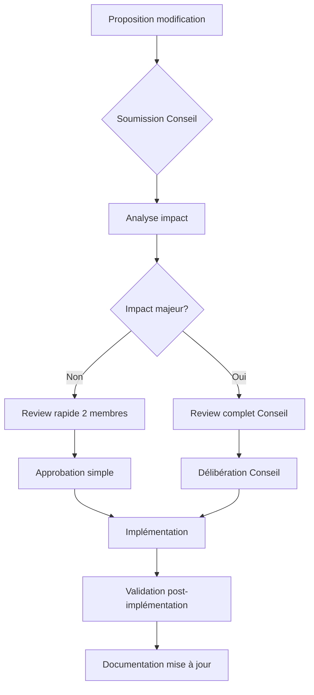

# 📜 Règles absolues pour développer un **RAG MCP Server**

> **Ce document définit les 6 règles NON NÉGOCIABLES** à respecter pour concevoir, développer et maintenir un système RAG (Retrieval-Augmented Generation) intégré à un **MCP Server**.
>
> Version: 2.0.0 | Dernière mise à jour: 2026-01-16
>
> ⚠️ **AVERTISSEMENT : VIOLATION CRITIQUE**
> Toute violation de ces règles absolues doit être signalée immédiatement
> et corrigée avant tout merge. Les violations répétées entraînent
> une revue d'architecture obligatoire par le Conseil d'Architecture Évolutive.

---

## 🔥 RÈGLE ABSOLUE #1 : Base décisionnelle immuable

### Principe

**Toute décision future concernant le RAG MCP Server doit impérativement se baser sur les règles existantes. Les règles elles-mêmes ne peuvent être modifiées qu'après revue officielle par le Conseil d'Architecture Évolutive.**

### Implications

1. **Stabilité garantie** : Pas de changement arbitraire d'architecture
2. **Cohérence maintenue** : Tous les développements suivent les mêmes principes
3. **Évolutivité contrôlée** : Les évolutions sont planifiées et validées
4. **Rétrocompatibilité** : Les changements ne cassent pas les implémentations existantes

### Processus de modification



### Exemples d'application

- ✅ **Autorisé** : Implémenter une nouvelle fonctionnalité selon les règles existantes
- ❌ **Interdit** : Changer l'ordre du pipeline RAG sans validation Conseil
- ❌ **Interdit** : Ajouter un backend hardcodé sans passer par la configuration
- ❌ **Interdit** : Créer des doublons de fichiers sans fusion/archivage

---

## 🔥 RÈGLE ABSOLUE #2 : Séparation stricte des responsabilités

### Principe

**Un module = une responsabilité = un contrat clair**

### Rôles et interdictions

| Élément        | Rôle                  | Interdiction absolue          |
| -------------- | --------------------- | ----------------------------- |
| `init_rag`     | Initialisation projet | ❌ Aucune exécution RAG        |
| `activate_rag` | Pipeline RAG runtime  | ❌ Aucune création de fichiers |
| MCP Server     | Orchestration         | ❌ Log texte dans stdout       |
| LLM (Ollama)   | Raisonnement          | ❌ Accès direct aux fichiers   |

### Conséquences

- `init_rag` crée uniquement les répertoires, fichiers de config et bases SQLite vides
- `activate_rag` vérifie l'initialisation puis exécute le pipeline RAG complet
- Tout accès filesystem passe par des outils MCP dédiés

---

## 🔥 RÈGLE ABSOLUE #3 : JSON strict ou rien

### Principe

**Tout ce qui transite vers MCP / LLM = JSON strict**

#### ✅ Autorisé

```json
{ "status": "ok", "step": "init_rag" }
```

#### ❌ Interdit

```
[init_rag] Détails : création DB...
```

### Logging séparé

| Flux      | Contenu                 | Destination          |
| --------- | ----------------------- | -------------------- |
| `stdout`  | JSON machine uniquement | MCP Client           |
| `stderr`  | erreurs techniques      | Terminal             |
| `rag.log` | logs humains structurés | Fichier de log       |

### Structure de log recommandée

```json
{
  "module": "rag.init",
  "action": "create_db",
  "status": "success",
  "timestamp": "ISO-8601"
}
```

---

## 🔥 RÈGLE ABSOLUE #4 : Architecture RAG obligatoire

### Structure de fichiers standard

```text
/rag/
 ├─ db/
 │   ├─ memory.sqlite
 │   ├─ vectors.sqlite
 │   └─ metadata.sqlite
 │
 ├─ config/
 │   ├─ rag.config.json
 │   ├─ db.config.json
 │   └─ embedding.config.json
 │
 ├─ logs/
 │   └─ rag.log
 │
 ├─ .ragignore
 └─ state.json
```

🚫 Aucun autre emplacement n'est autorisé

### Rôle EXCLUSIF de `init_rag`

`init_rag` **DOIT** :

1. Créer les répertoires `/rag/db` et `/rag/config`
2. Générer les fichiers de configuration par défaut
3. Initialiser les bases SQLite (tables vides)
4. Créer `.ragignore`
5. Enregistrer le projet dans la mémoire MCP
6. Retourner **UN SEUL JSON FINAL**

🚫 `init_rag` ne doit JAMAIS :

- analyser des fichiers
- générer des embeddings
- appeler un LLM

### Rôle EXCLUSIF de `activate_rag`

`activate_rag` **DOIT** :

1. Vérifier que `init_rag` a été exécuté
2. Charger la configuration
3. Exécuter le pipeline RAG :

   - Analyse
   - Chunking
   - Embeddings
   - Indexation
   - Retrieval

🚫 `activate_rag` ne doit JAMAIS :

- créer de fichiers système
- modifier la configuration

### Pipeline RAG — Ordre NON modifiable

```text
1. Scan fichiers
2. Filtrage (.ragignore)
3. Analyse structurelle
4. (Optionnel) Analyse LLM
5. Chunking
6. Embeddings
7. Indexation
8. Retrieval
```

🚫 Changer l'ordre = RAG instable

### Gestion d'état obligatoire

**`state.json` obligatoire** contient :

- version RAG
- backend DB
- état d'indexation
- date dernière mise à jour

---

## 🔥 RÈGLE ABSOLUE #5 : Base de données configurable uniquement

### Backend par défaut

```json
{
  "type": "sqlite",
  "mode": "local",
  "vector_extension": false
}
```

📌 PostgreSQL est **OPTIONNEL**, jamais hardcodé

### Interdictions absolues

- ❌ Aucun backend hardcodé
- ❌ Aucun `if (postgres)` dans le code
- ❌ Aucune dépendance système obligatoire

👉 Le backend est **CHOISI UNIQUEMENT via config**

### Stratégie multi-environnements

**SQLite pour développement, vraie DB vectore pour production**

#### Environnement développement

```json
{
  "database": {
    "type": "sqlite",
    "mode": "local",
    "vector_extension": false
  }
}
```

#### Environnement production

```json
{
  "database": {
    "type": "postgres", // ou pinecone, weaviate, qdrant
    "mode": "remote",
    "vector_extension": true,
    "connection": { /* config spécifique */ }
  }
}
```

### Migration obligatoire

**Scripts de migration doivent être fournis** pour SQLite → Production

---

## 🔥 RÈGLE ABSOLUE #6 : LLM & MCP — Règles d'or

### Ollama (ou autre LLM)

- ❌ N'analyse JAMAIS de fichiers directement
- ❌ Ne lit PAS le filesystem
- ✅ Reçoit UNIQUEMENT :

  - texte
  - JSON
  - chunks préparés

👉 Toute analyse de fichier passe par un **outil MCP**

### Analyse poussée par LLM (optionnelle)

```json
"deep_llm_analysis": false
```

- Désactivée par défaut
- Activée explicitement
- Exécutée **AVANT embeddings**
- Jamais bloquante

### Minimalisme MCP

**Limiter aux outils essentiels (5 maximum)**

| Outil | Rôle | Statut |
|-------|------|--------|
| `activated_rag` | Orchestration pipeline | Obligatoire |
| `get_status` | Consultation progression | Obligatoire |
| `query_rag` | Recherche sémantique | Obligatoire |
| `cancel_task` | Annulation tâche | Optionnel |
| `list_tasks` | Liste tâches | Optionnel |

### Messages IA-first

**Toute réponse MCP doit être optimisée pour interprétation IA**

```json
{
  "status": "success",
  "result": { /* données métier */ },
  "notes_for_ai": "Explication structurée pour l'IA",
  "allowed_actions": ["action1", "action2"],
  "next_steps": ["étape suggérée"]
}
```

### Schémas MCP complets

**Tout outil MCP doit avoir des schémas input/output validés**

```typescript
// src/core/mcp-schemas.ts
export const activatedRagSchema = {
  input: { /* schéma JSON Schema */ },
  output: { /* schéma JSON Schema */ },
  examples: [ /* exemples valides */ ]
};
```

---

## 🚨 Règles de survie (synthèse)

- 🧠 **Un LLM ne fait PAS du système**
- 🗂️ **Le filesystem n'est jamais implicite**
- 📄 **JSON strict ou crash**
- 🔌 **Pas de service externe obligatoire**
- 🧱 **Initialisation ≠ Exécution**
- 🔥 **Aucune duplication de code** (fusionner ou archiver)
- 🎯 **Messages IA-first obligatoires**
- ⚙️ **Configuration unique v3** (source de vérité)
- 🧪 **Tests multi-backends obligatoires**

---

## ✅ Conclusion

> Un RAG MCP Server est un **système distribué**, pas un script.

Respecter ces 6 règles absolues garantit :

- **Stabilité** : Pas de crash inattendu
- **Auditabilité** : Tout est traçable et loggé
- **Extensibilité** : Nouveaux backends, nouvelles phases
- **Maintenabilité** : Bugs localisables et corrigeables
- **Interopérabilité** : Compatible avec tout client MCP
- **Qualité IA** : Messages structurés, pilotage automatique
- **Zéro hallucination structurelle** : Architecture prévisible

🚀 **Toute implémentation future DOIT se conformer à ce document.**

---

**Mainteneurs:** Équipe RAG MCP Server  
**Contact:** Via issues GitHub  
**Dernière révision:** 2026-01-16  
**Prochaine révision:** 2026-03-16  
**Statut:** **ACTIF** - Conformité obligatoire pour tout nouveau développement
