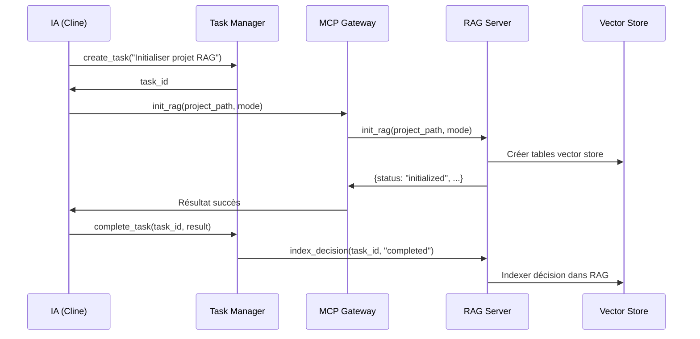
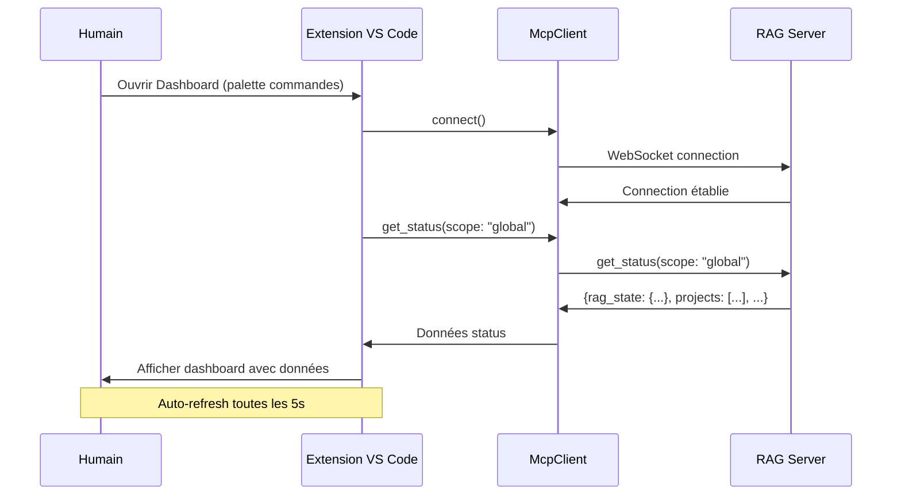
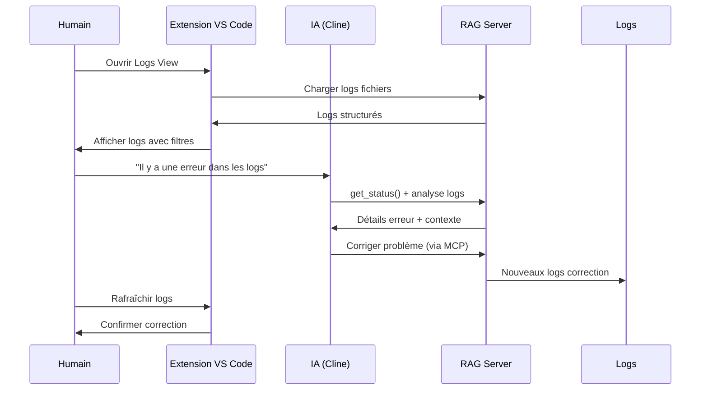

# Architecture : Séparation IA vs Humain

## 📋 Vue d'ensemble

Ce document décrit l'architecture de séparation stricte entre les rôles de l'**IA** (Cline) et des **humains** (développeurs) dans le système RAG MCP.

## 🎯 Principes fondamentaux

### 1. **IA = Opérations RAG**

- L'IA exécute toutes les opérations RAG via MCP
- L'IA est le seul acteur autorisé à appeler `init_rag`, `activated_rag`, `query_rag`
- L'IA prend des décisions basées sur le contexte sémantique

### 2. **Humain = Surveillance & Configuration**

- Les humains surveillent l'état du système via l'extension VS Code
- Les humains configurent le serveur MCP
- Les humains consultent les logs et métriques
- **Les humains n'exécutent pas d'opérations RAG**

### 3. **Séparation stricte des responsabilités**

- Pas de chevauchement des rôles
- Pas d'interface humaine pour exécuter des pipelines RAG
- Pas d'IA pour surveiller l'interface graphique

## 🏗️ Diagramme d'architecture

### Architecture complète

```
┌─────────────────────────────────────────────────────────────────────────┐
│                          ÉCOSYSTÈME RAG MCP COMPLET                     │
├─────────────────┐    ┌─────────────────┐    ┌─────────────────┐        │
│   IA (Cline)    │    │   Serveur MCP   │    │   Extension     │        │
│                 │    │   RAG MCP       │    │   VS Code       │        │
├─────────────────┤    ├─────────────────┤    ├─────────────────┤        │
│ • init_rag      │◄──►│ • init_rag      │    │ • Dashboard     │        │
│ • activated_rag │    │ • activated_rag │    │ • Configuration │        │
│ • query_rag     │    │ • query_rag     │    │ • Monitoring    │        │
│ • get_status    │    │ • get_status    │◄──►│ • Logs          │        │
│ • get_context   │    │ • get_context   │    │                 │        │
│ • index_decision│    │ • index_decision│    │                 │        │
└─────────────────┘    └─────────────────┘    └─────────────────┘        │
       │                       │                       │                  │
       └───────────────────────┴───────────────────────┘                  │
                 Communication MCP (WebSocket)                            │
                                                                          │
┌─────────────────────────────────────────────────────────────────────────┤
│                          FÉDÉRATION MCP                                 │
├─────────────────┐    ┌─────────────────┐    ┌─────────────────┐        │
│   Task Manager  │    │   MCP Gateway   │    │   Autres MCP    │        │
│                 │    │                 │    │   Servers       │        │
├─────────────────┤    ├─────────────────┤    ├─────────────────┤        │
│ • create_task   │    │ • route         │    │ • git           │        │
│ • complete_task │◄──►│ • validate      │◄──►│ • sqlite        │        │
│ • get_tasks     │    │ • detect_cycles │    │ • ollama        │        │
│ • emit_events   │    │ • log           │    │ • etc.          │        │
└─────────────────┘    └─────────────────┘    └─────────────────┘        │
                                                                          │
┌─────────────────────────────────────────────────────────────────────────┤
│                          CONTEXTE VS CODE                               │
├─────────────────────────────────────────────────────────────────────────┤
│ • Workspace configuration                                               │
│ • Git repository state                                                  │
│ • Project structure                                                     │
│ • VS Code settings & extensions                                         │
│ • Active editor context                                                 │
└─────────────────────────────────────────────────────────────────────────┘
```

### Flux d'opérations RAG (IA uniquement)

```
┌─────────────┐     ┌─────────────┐     ┌─────────────┐     ┌─────────────┐
│   Analyse   │     │   Décision  │     │  Exécution  │     │   Résultat  │
│   contexte  │────►│   opération │────►│   via MCP   │────►│   & logs    │
│   humain    │     │   RAG       │     │             │     │             │
└─────────────┘     └─────────────┘     └─────────────┘     └─────────────┘
       │                   │                   │                   │
       ▼                   ▼                   ▼                   ▼
┌─────────────┐     ┌─────────────┐     ┌─────────────┐     ┌─────────────┐
│   Historique│     │   Plan      │     │   Appel     │     │   Indexation│
│   chat      │     │   Task      │     │   tool MCP  │     │   décision  │
│   Cline     │     │   Manager   │     │             │     │   dans RAG  │
└─────────────┘     └─────────────┘     └─────────────┘     └─────────────┘
```

### Flux de surveillance humaine

```
┌─────────────┐     ┌─────────────┐     ┌─────────────┐     ┌─────────────┐
│   Ouverture │     │   Chargement│     │   Affichage │     │   Interaction│
│   extension │────►│   données   │────►│   interface │────►│   humaine    │
│   VS Code   │     │   via MCP   │     │   webview   │     │   (boutons)  │
└─────────────┘     └─────────────┘     └─────────────┘     └─────────────┘
       │                   │                   │                   │
       ▼                   ▼                   ▼                   ▼
┌─────────────┐     ┌─────────────┐     ┌─────────────┐     ┌─────────────┐
│   Commande  │     │   Appel     │     │   Mise à    │     │   Action    │
│   palette   │     │   get_status│     │   jour UI   │     │   config/   │
│   VS Code   │     │   ou logs   │     │   React     │     │   refresh   │
└─────────────┘     └─────────────┘     └─────────────┘     └─────────────┘
```

## 🔧 Composants techniques

### 1. **Serveur RAG MCP** (`rag-mcp-server`)

- **Rôle** : Exécuter les opérations RAG
- **Interface** : MCP (WebSocket)
- **Outils** : `init_rag`, `activated_rag`, `query_rag`, `get_status`, `get_context`, `index_decision`
- **Audience** : IA uniquement
- **Format** : JSON strict (R3)

### 2. **Extension VS Code** (`extension-rag`)

- **Rôle** : Surveillance et configuration humaine
- **Interface** : Webview panels + VS Code API
- **Fonctionnalités** : Dashboard, Configuration, Monitoring, Logs
- **Audience** : Humains uniquement
- **Format** : Interface graphique avec tokens VS Code

### 3. **MCP Gateway** (`mcp-gateway`)

- **Rôle** : Router et valider les communications MCP
- **Interface** : MCP standard
- **Fonctionnalités** : Routing, validation JSON Schema, détection cycles, logs
- **Audience** : Tous les clients MCP (IA + autres serveurs)

### 4. **Task Manager MCP**

- **Rôle** : Gérer les tâches et événements
- **Interface** : MCP standard
- **Fonctionnalités** : Création tâches, événements, historique
- **Audience** : IA pour planification, RAG pour indexation

### 5. **Context Service** (`ContextService.ts`)

- **Rôle** : Récupérer le contexte VS Code
- **Interface** : VS Code API
- **Données** : Workspace, Git, configuration, structure projet
- **Usage** : Enrichir les requêtes RAG avec contexte humain

## 📊 Tableau de comparaison IA vs Humain

| Aspect             | IA (Cline)                                          | Humain (Développeur)                 |
| ------------------ | --------------------------------------------------- | ------------------------------------ |
| **Opérations RAG** | ✅ Exécute `init_rag`, `activated_rag`, `query_rag` | ❌ Ne peut pas exécuter              |
| **Surveillance**   | ✅ Peut appeler `get_status` pour contexte          | ✅ Utilise l'extension VS Code       |
| **Configuration**  | ❌ Ne configure pas le serveur                      | ✅ Configure via l'extension         |
| **Logs**           | ✅ Reçoit logs via stderr                           | ✅ Visualise via interface graphique |
| **Décisions**      | ✅ Prend décisions basées contexte                  | ❌ Ne prend pas décisions RAG        |
| **Planification**  | ✅ Utilise Task Manager                             | ❌ Ne planifie pas tâches RAG        |
| **Interface**      | MCP (JSON)                                          | VS Code Extension (UI)               |
| **Format données** | JSON strict                                         | Interface graphique                  |
| **Fréquence**      | Continu (automatisé)                                | Ponctuel (sur demande)               |

## 🚀 Workflows spécifiques

### Workflow IA : Initialisation projet RAG



### Workflow Humain : Surveillance serveur



### Workflow mixte : Debug problème



## 🔒 Règles de sécurité et gouvernance

### R1 : IA ≠ Décideur architectural

- L'IA peut proposer, analyser, suggérer
- L'IA ne peut pas : choisir backend, modifier pipeline, changer règles
- Toutes décisions architecturales = règles existantes + validation humaine

### R2 : Séparation des responsabilités

- Module `init_rag` = initialisation projet uniquement
- Module `activated_rag` = pipeline RAG uniquement
- MCP Server = orchestration uniquement
- LLM = raisonnement uniquement (pas d'accès direct fichiers)

### R3 : JSON strict pour MCP

- ✅ JSON pur pour MCP (`result`, `status`, ...)
- ❌ Pas d'icônes ni décorations dans JSON métier
- ✅ Icônes seulement dans logs humains
- ✅ Logs humains séparés (`stderr` ou `rag.log`)

### R4 : Usage unique commandes MCP

- `init_rag` & `activated_rag` = 1 seule exécution
- Répétition = `command_already_executed`
- Validation ordre automatique avant exécution

### R5 : Immutabilité `state.json`

- Modifiable uniquement par moteur RAG
- ❌ Pas d'édition manuelle ou "fix IA"
- Toute mutation = trace log obligatoire

## 📈 Métriques et observabilité

### Métriques IA

- Nombre d'appels `init_rag` / `activated_rag` / `query_rag`
- Taux de succès/échec par opération
- Temps d'exécution moyen
- Contexte sémantique utilisé pour décisions

### Métriques Humain

- Nombre d'ouvertures dashboard/config/monitor/logs
- Temps passé dans chaque vue
- Actions configurées (changements paramètres)
- Fréquence rafraîchissement auto

### Métriques Système

- État connexion MCP
- Nombre projets initialisés
- Taille vector store
- Performance embeddings
- Latence requêtes

## 🚨 Scénarios d'erreur et récupération

### Erreur IA

1. **Échec `init_rag`** : IA reçoit `error_details`, décide reprise/abandon
2. **Timeout `activated_rag`** : IA peut `cancel_task` et réessayer
3. **`query_rag` sans résultats** : IA ajuste paramètres ou suggère indexation

### Erreur Humain

1. **Connexion serveur échouée** : Extension montre erreur + bouton test
2. **Dashboard ne se rafraîchit pas** : Bouton refresh manuel + logs
3. **Configuration invalide** : Validation formulaire + messages erreur

### Erreur Système

1. **Serveur MCP down** : Extension montre état déconnecté
2. **Vector store inaccessible** : `get_status` retourne erreur détaillée
3. **Memory leak** : Monitoring montre croissance mémoire

## 🔮 Évolution future

### Améliorations IA

- Meilleur contexte sémantique via `get_context`
- Décisions plus intelligentes basées historique
- Apprentissage des patterns d'erreur
- Optimisation automatique paramètres

### Améliorations Humain

- Dashboards plus détaillés
- Alertes proactives (notifications VS Code)
- Rapports de performance
- Export données pour analyse

### Améliorations Système

- Fédération MCP étendue
- Cache intelligent embeddings
- Réplication vector store
- Backup/restore automatisé

## 📚 Références

- [Règles Absolues RAG MCP Server](Règles_Absolues_Rag_Mcp_Server.md)
- [README Extension VS Code](extension-rag/README.md)
- [FEDERATION_ARCHITECTURE.md](FEDERATION_ARCHITECTURE.md)
- [MCP Specification](https://spec.modelcontextprotocol.io/)

---

**Dernière mise à jour** : 30/01/2026
**Version architecture** : 3.0.0
**Responsable** : Conseil d'Architecture RAG MCP
