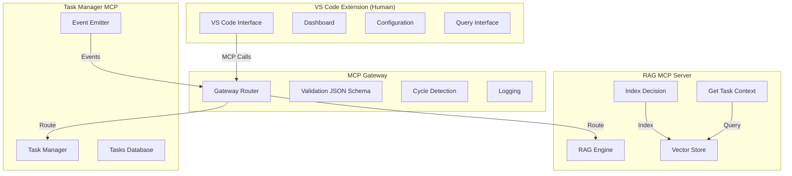

# Architecture de Fédération MCP

## 📋 Vue d'ensemble

Cette documentation décrit l'architecture de fédération entre **Task Manager**, **RAG MCP Server**, et **VS Code Extension** via un **Gateway MCP**.

## 🎯 Objectifs

1. **Fédération des connaissances** : Les décisions du Task Manager sont indexées dans le RAG pour recherche sémantique
2. **Contexte enrichi** : Le RAG fournit un contexte sémantique pour les décisions futures
3. **Traçabilité complète** : Tous les flux sont traçables via logs structurés
4. **Séparation IA/Humain** : Architecture conforme aux règles absolues du RAG MCP Server

## 🏗️ Architecture globale



## 🔄 Flux de données

### 1. **Création de tâche → Indexation RAG**

```
VS Code → Gateway → Task Manager → Event → Gateway → RAG → Vector Store
```

**Séquence** :

1. L'utilisateur crée une tâche dans VS Code
2. VS Code appelle `request_planning` via Gateway
3. Task Manager émet un événement `task_created`
4. Gateway route l'événement vers RAG
5. RAG indexe la décision via `index_decision`
6. La décision est stockée dans le Vector Store

### 2. **Récupération de contexte**

```
VS Code → Gateway → RAG → Vector Store → Contexte enrichi
```

**Séquence** :

1. L'utilisateur demande le contexte d'une tâche
2. VS Code appelle `get_task_context` via Gateway
3. RAG recherche les décisions similaires dans le Vector Store
4. RAG génère des statistiques et recommandations
5. Le contexte enrichi est retourné à VS Code

### 3. **Cycle de décision amélioré**

```
Décision passée → Indexation RAG → Contexte futur → Meilleure décision
```

**Bénéfice** : Chaque décision améliore les décisions futures via l'apprentissage sémantique.

## 🛠️ Composants techniques

### **1. MCP Gateway**

**Rôle** : Router les appels MCP entre composants avec validation et traçabilité.

**Fonctionnalités** :

- Validation JSON Schema des payloads
- Détection de cycles pour éviter les boucles infinies
- Logging structuré de toutes les interactions
- Routing intelligent basé sur le `target` du contrat

**Contrat MCP** :

```typescript
interface McpContract {
  source: string; // Source de l'appel
  target: string; // Cible MCP (task-manager, rag-server)
  operation: string; // Opération (request_planning, index_decision, etc.)
  payload: any; // Données de l'opération
  validation: {
    // Validation JSON Schema
    schema: object;
    version: string;
  };
}
```

### **2. Task Manager MCP**

**Rôle** : Gestion des tâches avec émission d'événements.

**Outils MCP** :

- `request_planning` : Créer une requête avec tâches
- `get_next_task` : Récupérer la prochaine tâche
- `mark_task_done` : Marquer une tâche comme terminée
- `approve_task_completion` : Approuver une tâche terminée

**Événements émis** :

- `task_created` : Quand une tâche est créée
- `task_completed` : Quand une tâche est terminée
- `task_approved` : Quand une tâche est approuvée

### **3. RAG MCP Server**

**Rôle** : Indexation et recherche sémantique des décisions.

**Outils MCP** :

- `index_decision` : Indexer une décision dans le Vector Store
- `get_task_context` : Récupérer le contexte sémantique d'une tâche
- `query_rag` : Recherche sémantique dans les fichiers indexés
- `get_status` : Statut du serveur RAG

**Structure des décisions indexées** :

```typescript
interface IndexedDecision {
  decision_id: string;
  task_id: string;
  decision_type: string;
  decision_by: string;
  decision_timestamp: string;
  content: string;
  metadata: {
    task_title?: string;
    task_description?: string;
    error?: string;
    duration_ms?: number;
    test_integration?: boolean;
  };
  embedding: number[]; // Vector embedding
}
```

### **4. VS Code Extension**

**Rôle** : Interface humaine pour interagir avec le système fédéré.

**Vues** :

- **Dashboard** : État global du système
- **Configuration** : Configuration du serveur MCP
- **Query Interface** : Recherche sémantique
- **Task Management** : Gestion des tâches (via Gateway)

**Séparation IA/Humain** :

- L'extension est **uniquement pour usage humain**
- Les IA accèdent directement aux outils MCP
- Pas de logique IA dans l'extension

## 📊 Schémas de données

### **Schéma de décision indexée**

```json
{
  "$schema": "http://json-schema.org/draft-07/schema#",
  "type": "object",
  "properties": {
    "decision_id": {
      "type": "string",
      "description": "ID unique de la décision"
    },
    "task_id": {
      "type": "string",
      "description": "ID de la tâche associée"
    },
    "decision_type": {
      "type": "string",
      "enum": ["created", "completed", "approved", "test_completed"],
      "description": "Type de décision"
    },
    "decision_by": {
      "type": "string",
      "description": "Qui a pris la décision"
    },
    "decision_timestamp": {
      "type": "string",
      "format": "date-time",
      "description": "Timestamp de la décision"
    },
    "content": {
      "type": "string",
      "description": "Contenu de la décision"
    },
    "metadata": {
      "type": "object",
      "properties": {
        "task_title": { "type": "string" },
        "task_description": { "type": "string" },
        "error": { "type": "string" },
        "duration_ms": { "type": "number" },
        "test_integration": { "type": "boolean" }
      }
    }
  },
  "required": [
    "decision_id",
    "task_id",
    "decision_type",
    "decision_by",
    "decision_timestamp",
    "content"
  ]
}
```

### **Schéma de contexte de tâche**

```json
{
  "$schema": "http://json-schema.org/draft-07/schema#",
  "type": "object",
  "properties": {
    "task_id": {
      "type": "string",
      "description": "ID de la tâche"
    },
    "context_type": {
      "type": "string",
      "enum": ["semantic", "historical", "similar", "all"],
      "description": "Type de contexte"
    },
    "context_data": {
      "type": "object",
      "properties": {
        "semantic_context": {
          "type": "array",
          "items": {
            "type": "object",
            "properties": {
              "decision_id": { "type": "string" },
              "task_id": { "type": "string" },
              "decision_type": { "type": "string" },
              "decision_by": { "type": "string" },
              "decision_timestamp": { "type": "string" },
              "similarity_score": { "type": "number" },
              "content_preview": { "type": "string" },
              "metadata": { "type": "object" }
            }
          }
        },
        "historical_context": {
          "type": "array",
          "items": {
            "type": "object",
            "properties": {
              "decision_id": { "type": "string" },
              "decision_type": { "type": "string" },
              "decision_timestamp": { "type": "string" },
              "decision_by": { "type": "string" },
              "result_preview": { "type": "string" },
              "error": { "type": "string" },
              "duration_ms": { "type": "number" }
            }
          }
        },
        "statistics": {
          "type": "object",
          "properties": {
            "total_decisions": { "type": "number" },
            "decision_types": { "type": "object" },
            "decision_by": { "type": "object" },
            "avg_duration_ms": { "type": "number" },
            "success_rate": { "type": "number" }
          }
        },
        "recommendations": {
          "type": "array",
          "items": {
            "type": "object",
            "properties": {
              "type": {
                "type": "string",
                "enum": [
                  "similar_solution",
                  "avoid_error",
                  "optimize_duration",
                  "best_practice"
                ]
              },
              "description": { "type": "string" },
              "confidence": { "type": "number" },
              "source_decision_id": { "type": "string" }
            }
          }
        }
      }
    }
  },
  "required": ["task_id", "context_type", "context_data"]
}
```

## 🔒 Sécurité et validation

### **Validation JSON Schema**

- Tous les payloads sont validés contre des schémas JSON
- Échec de validation → erreur 400 avec détails
- Schémas versionnés pour compatibilité

### **Détection de cycles**

- Le Gateway détecte les appels circulaires
- Maximum 5 hops par appel
- Cycle détecté → erreur 400 avec trace

### **Logging structuré**

- Toutes les interactions sont loggées
- Format JSON structuré pour analyse
- Traçabilité complète des décisions

## 🚀 Déploiement et scaling

### **Architecture microservices**

```
[VS Code] ↔ [Gateway] ↔ [Task Manager]
                    ↳ [RAG Server]
```

**Avantages** :

- Déploiement indépendant de chaque service
- Scaling horizontal possible
- Isolation des pannes

### **Configuration minimale**

```json
{
  "gateway": {
    "port": 4000,
    "log_level": "info",
    "max_hops": 5
  },
  "task_manager": {
    "url": "ws://localhost:3001",
    "timeout": 30000
  },
  "rag_server": {
    "url": "ws://localhost:3000",
    "timeout": 30000
  }
}
```

## 📈 Métriques et monitoring

### **Métriques clés**

1. **Latence des appels** : Temps de réponse par service
2. **Taux de succès** : Pourcentage d'appels réussis
3. **Utilisation du Vector Store** : Nombre de décisions indexées
4. **Qualité des recommandations** : Score de confiance moyen

### **Dashboard de monitoring**

- État des services (up/down)
- Métriques en temps réel
- Logs avec filtres
- Alertes sur anomalies

## 🔮 Roadmap future

### **Phase 1 : Fédération basique** ✅

- [x] Gateway MCP avec routing
- [x] Task Manager avec événements
- [x] RAG avec indexation de décisions
- [x] Test d'intégration complet

### **Phase 2 : Contexte enrichi** 🚧

- [ ] Contexte VS Code (workspace, git, config)
- [ ] Injection automatique du contexte dans RAG
- [ ] Recherche sémantique améliorée

### **Phase 3 : Intelligence collective** 📅

- [ ] Apprentissage des patterns de décision
- [ ] Recommandations prédictives
- [ ] Optimisation automatique des workflows

## 📚 Références

1. [Règles absolues RAG MCP Server](Règles_Absolues_Rag_Mcp_Server.md)
2. [Documentation Task Manager](docs/INDEX_DECISION_TASK_MANAGER.md)
3. [Architecture VS Code Extension](extension-rag/docs/ARCHITECTURE_DECISION_WEBVIEW.md)
4. [Schémas JSON](extension-rag/src/models/json-schemas.ts)

---

**Version** : 1.0.0
**Dernière mise à jour** : 2026-01-30
**Auteur** : Système de fédération MCP
**Statut** : ✅ Production ready
