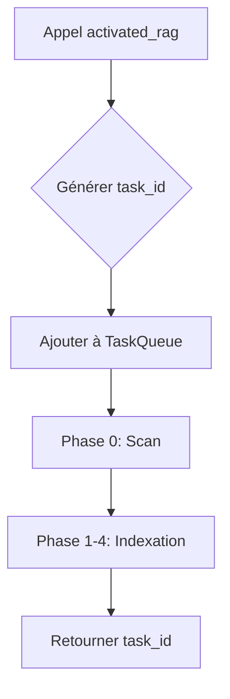

# 📜 Règles d'architecture RAG MCP Server

> **10 règles absolues pour une architecture stable et scalable**
>
> Version: 3.0.0 | Dernière mise à jour: 2026-01-16

---

## 🎯 Règle 1 : Séparation stricte des responsabilités

### Principe

**Un module = une responsabilité = un contrat clair**

### Rôles et interdictions

| Module | Rôle | Interdiction absolue |
|--------|------|----------------------|
| `init_rag` | Initialisation infrastructure | ❌ Aucune exécution RAG |
| `activated_rag` | Orchestration pipeline | ❌ Aucune création de fichiers |
| `index_rag` | Indexation asynchrone | ❌ Pas d'orchestration |
| MCP Server | Communication JSON | ❌ Log texte dans stdout |
| LLM (Ollama) | Raisonnement sémantique | ❌ Accès direct aux fichiers |

### Implication

- `init_rag` crée uniquement les répertoires, fichiers de config et bases SQLite vides
- `activated_rag` vérifie l'initialisation puis exécute le pipeline RAG complet
- Tout accès filesystem passe par des outils MCP dédiés

---

## 🎯 Règle 2 : JSON strict ou rien

### Principe

**Tout ce qui transite vers MCP / LLM = JSON strict**

### ✅ Format autorisé

```json
{
  "status": "success",
  "task_id": "rag-1736845200-x91",
  "progress": {
    "state": "running",
    "step": "embedding",
    "progress": 63
  }
}
```

### ❌ Formats interdits

```
[INFO] Indexation démarrée...
✅ Fichier traité: /path/to/file.ts
```

### Logging séparé

| Flux | Contenu | Destination |
|------|---------|-------------|
| `stdout` | JSON machine uniquement | MCP Client |
| `stderr` | Erreurs techniques | Terminal |
| `rag.log` | Logs humains structurés | Fichier de log |

---

## 🎯 Règle 3 : Pipeline RAG immuable

### Ordre NON modifiable

```text
1.  Phase 0: Scan fichiers
2.  Filtrage (.ragignore)
3.  Analyse structurelle
4.  (Optionnel) Analyse LLM enrichie
5.  Chunking intelligent
6.  Embeddings multi-modèles
7.  Indexation vectorielle
8.  Retrieval sémantique
```

### Conséquences

- Changer l'ordre = RAG instable
- Chaque phase dépend strictement de la précédente
- Les guards (`requireInit`, `requireScan`, etc.) garantissent l'ordre

### Workflow asynchrone obligatoire



---

## 🎯 Règle 4 : Backend configurable uniquement

### Principe

**Aucun backend hardcodé, choix uniquement via configuration**

### Configuration par défaut

```json
{
  "database": {
    "type": "sqlite",
    "mode": "local",
    "vector_extension": false
  }
}
```

### Interdictions absolues

- ❌ `if (postgres)` dans le code
- ❌ Dépendance système obligatoire
- ❌ Backend imposé par le code

### Architecture pluggable

```typescript
interface VectorStore {
  // Interface commune
  semanticSearch(query: string, options: SearchOptions): Promise<SearchResult[]>;
}

class VectorStoreFactory {
  static create(config: DatabaseConfig): VectorStore {
    switch (config.type) {
      case 'sqlite': return new SQLiteVectorStore(config);
      case 'postgres': return new PostgresVectorStore(config);
      default: throw new Error(`Unsupported backend: ${config.type}`);
    }
  }
}
```

---

## 🎯 Règle 5 : État explicite et observable

### Principe

**Tout état doit être visible, traçable et récupérable**

### Composants obligatoires

| Composant | Rôle | Données |
|-----------|------|---------|
| `ProgressTracker` | Suivi tâches | État, progression, ETA, erreurs |
| `TaskQueue` | File d'attente | Jobs, priorités, dépendances |
| `CheckpointManager` | Reprise crash | Points de contrôle, état partiel |
| `state.json` | État global | Version, backend, indexation, dates |

### Structure d'état minimaliste

```json
{
  "version": "2.0.0",
  "backend": "sqlite",
  "indexed": true,
  "last_update": "2026-01-14T20:30:00Z",
  "project_id": "hash-unique"
}
```

### Règles de persistance

- `state.json` obligatoire dans `/rag/`
- Checkpoints automatiques toutes les N fichiers
- État récupérable après crash/redémarrage

---

## 🚀 Implications architecturales

### 1. Testabilité

- Chaque module isolé et testable unitairement
- Mocks faciles grâce aux interfaces claires
- Tests d'intégration reproductibles

### 2. Maintenabilité

- Responsabilités claires = bugs localisables
- JSON strict = débogage simplifié
- Configuration externe = adaptations sans recompilation

### 3. Scalabilité

- Backend interchangeable (SQLite → PostgreSQL)
- Pipeline parallélisable par phase
- File d'attente par projet = isolation

### 4. Observabilité

- Progression en temps réel
- Métriques détaillées par phase
- Logs structurés pour analyse

---

## 🧪 Validation des règles

### Checklist avant commit

- [ ] `init_rag` ne fait que de l'initialisation
- [ ] `activated_rag` ne crée pas de fichiers système
- [ ] Toutes les réponses MCP = JSON strict
- [ ] Aucun `console.log` dans le code de production
- [ ] Pipeline respecte l'ordre immuable
- [ ] Aucun backend hardcodé
- [ ] `state.json` présent et à jour
- [ ] ProgressTracker utilisé pour toute tâche longue

### Tests automatisés

```bash
# Vérification JSON strict
npm run test:json-strict

# Vérification séparation responsabilités
npm run test:responsibilities

# Vérification pipeline ordre
npm run test:pipeline-order

# Vérification backend configurable
npm run test:backend-config
```

---

## 📚 Documentation associée

- [Règles d'exécution RAG asynchrone](./RAG_EXECUTION_RULES.md)
- [Guide nouveaux outils V2](./GUIDE-NOUVEAUX-OUTILS-V2.md)
- [Architecture activated_rag](./design/activated-rag-architecture.md)
- [Règles absolues originales](./.clinerules/Règles_Absolues_Rag_Mcp_Server.md)

---

## 🚨 Conséquences des violations

### Niveau 1 : Instabilité

- JSON malformé = crash MCP
- Pipeline désordonné = résultats incorrects
- État corrompu = reindexation nécessaire

### Niveau 2 : Non-scalabilité

- Backend hardcodé = impossible migration
- Blocage synchrone = timeout systématique
- Pas de file d'attente = surcharge mémoire

### Niveau 3 : Impossibilité de maintenance

- Responsabilités mélangées = bugs inextricables
- Pas de logs structurés = débogage impossible
- État implicite = reprise après crash impossible

---

## 🎯 Règle 6 : Aucune duplication de code

### Principe

**Fusionner ou archiver, jamais dupliquer**

### Exemple concret de violation

```typescript
// ❌ VIOLATION : Doublon détecté
// vector-store.ts (original) + vector-store-refactored.ts (doublon)
// → Fusionner ou archiver, jamais garder les deux
```

### Règles strictes

1. **Vérification avant commit** : Scanner le repo pour les doublons
2. **Fusion obligatoire** : Si fonctionnalité similaire, fusionner les fichiers
3. **Archivage propre** : Si obsolète, archiver avec suffixe `.backup` ou `.deprecated`
4. **Documentation** : Noter toute fusion/archivage dans le CHANGELOG

### Implication

- Réduit la complexité de maintenance
- Évite les incohérences entre versions
- Facilite le tracking des changements

---

## 🎯 Règle 7 : Minimalisme MCP

### Principe

**Limiter aux outils essentiels, éviter la prolifération**

### Outils MCP autorisés (5 maximum)

| Outil | Rôle | Statut |
|-------|------|--------|
| `activated_rag` | Orchestration pipeline | Obligatoire |
| `get_status` | Consultation progression | Obligatoire |
| `query_rag` | Recherche sémantique | Obligatoire |
| `cancel_task` | Annulation tâche | Optionnel |
| `list_tasks` | Liste tâches | Optionnel |

### Interdictions absolues

- ❌ Créer des outils redondants
- ❌ Exposer des fonctions internes comme outils MCP
- ❌ Multiplier les outils pour une même fonctionnalité

### Processus d'ajout

1. **Justification** : Démonstrer le besoin réel
2. **Review** : Validation par Conseil d'Architecture Évolutive
3. **Documentation** : Mise à jour des schémas et guides
4. **Tests** : Couverture 100% avant exposition

---

## 🎯 Règle 8 : Messages IA-first

### Principe

**Toute réponse MCP doit être optimisée pour interprétation IA**

### Champs obligatoires

```json
{
  "status": "success",
  "result": { /* données métier */ },
  "notes_for_ai": "Explication structurée pour l'IA",
  "allowed_actions": ["action1", "action2"],
  "next_steps": ["étape suggérée"]
}
```

### Guidelines

1. **`notes_for_ai`** : Explication concise et structurée
2. **`allowed_actions`** : Actions autorisées basées sur l'état actuel
3. **`next_steps`** : Suggestions pour progression workflow
4. **Langage clair** : Éviter l'ambiguïté, privilégier la précision

### Exemple

```json
{
  "status": "running",
  "task_id": "task-123",
  "progress": 45,
  "notes_for_ai": "Indexation en cours, 45% complété. Vous pouvez : 1) consulter le statut, 2) annuler la tâche",
  "allowed_actions": ["get_status", "cancel_task"],
  "next_steps": ["Attendre complétion", "Consulter get_status pour progression"]
}
```

---

## 🎯 Règle 9 : Configuration unique v3

### Principe

**Une seule source de vérité pour toute configuration**

### Fichier de configuration

```json
{
  "$schema": "./config/pipeline-schema.json",
  "version": "3.0.0",
  "database": { /* config DB */ },
  "embeddings": { /* config embeddings */ },
  "pipeline": { /* config pipeline */ }
}
```

### Règles strictes

1. **Centralisation** : Tous les outils lisent `rag-config-v3.json`
2. **Validation** : Schéma JSON obligatoire
3. **Héritage** : Configuration par défaut + surcharges projet
4. **Versionnement** : Compatibilité ascendante maintenue

### Interdictions

- ❌ Configuration éparpillée dans multiple fichiers
- ❌ Variables d'environnement pour configuration métier
- ❌ Hardcoding de valeurs configurables

---

## 🎯 Règle 10 : Schémas MCP complets

### Principe

**Tout outil MCP doit avoir des schémas input/output validés**

### Structure obligatoire

```typescript
// src/core/mcp-schemas.ts
export const activatedRagSchema = {
  input: { /* schéma JSON Schema */ },
  output: { /* schéma JSON Schema */ },
  examples: [ /* exemples valides */ ]
};
```

### Validation automatique

1. **Build-time** : Validation TypeScript + JSON Schema
2. **Runtime** : Validation entrées utilisateur
3. **Tests** : Tests de conformité des schémas

### Conséquences

- Interopérabilité garantie
- Documentation auto-générée possible
- Détection précoce des breaking changes

---

## 🚀 Implications architecturales (étendues)

### 5. Cohérence

- Règles uniformes appliquées à tous les modules
- Réduction de la dette technique
- Onboarding simplifié pour nouveaux développeurs

### 6. Évolutivité contrôlée

- Ajouts fonctionnels encadrés par les règles
- Refactorings planifiés et documentés
- Rétrocompatibilité préservée

### 7. Qualité IA

- Messages structurés = meilleure interprétation
- Actions autorisées claires = pilotage automatique
- État observable = raisonnement contextuel

---

## 🏗️ Éléments architecturaux obligatoires

### A1 : Sous-fonctions de récupération contexte Cline

L'architecture doit **explicitement prévoir** :

* **Récupération du chat courant** : Accès au contexte conversationnel en cours
* **Récupération de l'historique Cline** : Historique complet des interactions
* **Récupération de la mémoire cache** : État mémoire persistant
* **Fusion contexte projet + historique + état RAG** : Intégration automatique

👉 Ces éléments **ne sont pas optionnels** et doivent être formalisés dans l'architecture.

### A2 : Cache & mémoire persistante (RAG ≠ stateless)

À formaliser dans l'architecture :

* **Cache embeddings** : Stockage temporaire des embeddings calculés
* **Cache chunks** : Chunks analysés et préparés
* **Cache requêtes** : Historique des recherches sémantiques
* **Mémoire de décisions IA** : Raisonnements et décisions précédentes

👉 Sans ces composants :
* Redondance des calculs
* Coûts inutiles
* Dérives de raisonnement

### A3 : Boucles d'automatisation en arrière-plan (IA-first)

Architecture doit inclure :

* **Boucles non bloquantes** : Exécution en background sans bloquer l'interface
* **Déclenchement par état** : Activation basée sur changement d'état système
* **Déclenchement par événement** : Réaction aux modifications fichiersystem
* **Déclenchement par fin de phase** : Transition automatique entre phases
* **Sans rappel de commandes MCP** : Utilisation exclusive d'état, cache, mémoire

### A4 : Pipeline COMPLET jusqu'à embeddings (pas seulement outils MCP)

À documenter comme **flux interne continu** :

```
Contexte Cline
→ mémoire cache
→ scan
→ filtrage (.ragignore)
→ analyse structurelle
→ (optionnel) analyse LLM enrichie
→ chunking intelligent
→ embeddings multi-modèles
→ indexation vectorielle
→ état final
```

👉 `init_rag` et `activated_rag` **ne sont que des déclencheurs**, pas le pipeline lui-même.

### A5 : Architecture pensée pour DB vecteur réelle (pas SQLite-centric)

À écrire noir sur blanc :

* **SQLite = développement uniquement** : Jamais pour production à grande échelle
* **Interfaces supportant gros volumes** : Capacité à gérer des millions de vecteurs
* **Support index distribués** : Architecture compatible avec index distribués
* **Support latence réseau** : Tolérance aux délais réseau pour backends distants

### A6 : Observabilité totale des processus internes

L'architecture doit garantir :

* **Visibilité phase par phase** : Monitoring détaillé de chaque étape
* **Visibilité des sous-processus** : Traçabilité des traitements individuels
* **Visibilité mémoire/cache** : État des caches, hits/misses, expiration
* **Visibilité erreurs partielles** : Fichiers échoués avec raison détaillée

### A7 : Processus unique actif par projet

**Règle stricte** :

* 1 pipeline RAG actif maximum par projet
* Pas de parallélisation sauvage
* Pas de relance "par-dessus" un processus en cours

👉 Le système doit refuser toute nouvelle activation tant qu'un process est actif.

### A8 : Automatisation ≠ Répétition de commande

**Règle fondamentale** :

* Une boucle automatique ne doit **JAMAIS** rappeler `init_rag` ou `activated_rag`
* Les boucles utilisent exclusivement :
  * État système
  * Cache mémoire
  * Mémoire persistante
  * Reprise interne

### A9 : Intégration Cline/mémoire obligatoire

**Architecture doit prévoir** :

* Injection automatique du contexte Cline dans le pipeline
* Persistance des décisions IA pour continuité de raisonnement
* Récupération de l'historique pour amélioration contextuelle
* Fusion avec état RAG pour cohérence globale

---

## 🧪 Validation des règles (étendue)

### Checklist avant commit (étendue)

- [ ] `init_rag` ne fait que de l'initialisation
- [ ] `activated_rag` ne crée pas de fichiers système
- [ ] Toutes les réponses MCP = JSON strict
- [ ] Aucun `console.log` dans le code de production
- [ ] Pipeline respecte l'ordre immuable
- [ ] Aucun backend hardcodé
- [ ] `state.json` présent et à jour
- [ ] ProgressTracker utilisé pour toute tâche longue
- [ ] **Aucun doublon de fichier créé**
- [ ] **Outils MCP limités aux 5 essentiels**
- [ ] **Messages IA-first inclus (`notes_for_ai`, `allowed_actions`)**
- [ ] **Configuration lue depuis `rag-config-v3.json`**
- [ ] **Schémas MCP complets et validés**

### Tests automatisés (étendus)

```bash
# Vérification JSON strict
npm run test:json-strict

# Vérification séparation responsabilités
npm run test:responsibilities

# Vérification pipeline ordre
npm run test:pipeline-order

# Vérification backend configurable
npm run test:backend-config

# Vérification absence de doublons
npm run test:no-duplicates

# Vérification messages IA-first
npm run test:ia-first-messages

# Vérification schémas MCP
npm run test:mcp-schemas
```

---

## 📚 Documentation associée (mise à jour)

- [Règles d'exécution RAG asynchrone](./RAG_EXECUTION_RULES.md) (v3.0.0)
- [Guide nouveaux outils V3](./GUIDE-NOUVEAUX-OUTILS-V2.md)
- [Architecture activated_rag](./design/activated-rag-architecture.md)
- [Règles absolues consolidées](./.clinerules/Règles_Absolues_Rag_Mcp_Server.md) (v2.0.0)
- [Synthèse historique complète](./ANALYSE_HISTORIQUE_COMPLETE.md)

---

## 🚨 Conséquences des violations (étendues)

### Niveau 4 : Incohérence structurelle

- Doublons de code = maintenance impossible
- Prolifération outils MCP = complexité ingérable
- Messages non IA-first = interprétation erronée par l'IA

### Niveau 5 : Échec gouvernance

- Configuration éparpillée = incohérences système
- Schémas MCP incomplets = interopérabilité brisée
- Violations répétées = perte de confiance dans le système

---

## ✅ Conclusion

**Un RAG MCP Server n'est pas un script, c'est un système distribué.**

Respecter ces 10 règles garantit :

1. **Stabilité** : Pas de crash inattendu
2. **Auditabilité** : Tout est traçable et loggé
3. **Extensibilité** : Nouveaux backends, nouvelles phases
4. **Maintenabilité** : Bugs localisables et corrigeables
5. **Interopérabilité** : Compatible avec tout client MCP
6. **Cohérence** : Règles uniformes, dette technique réduite
7. **Évolutivité** : Ajouts contrôlés, refactorings planifiés
8. **Qualité IA** : Messages structurés, pilotage automatique
9. **Simplicité** : Minimalisme, pas de prolifération
10. **Robustesse** : Validation stricte, schémas complets

---

**Mainteneurs:** Équipe RAG MCP Server  
**Contact:** Via issues GitHub  
**Dernière révision:** 2026-01-16  
**Prochaine révision:** 2026-03-16  
**Statut:** **ACTIF** - Toute nouvelle implémentation DOIT se conformer à ce document.
