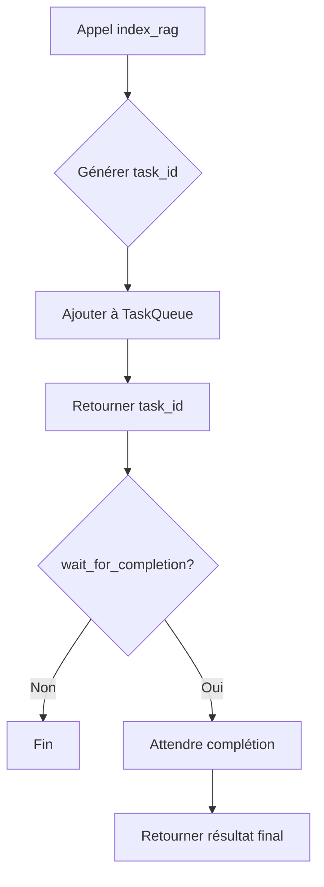
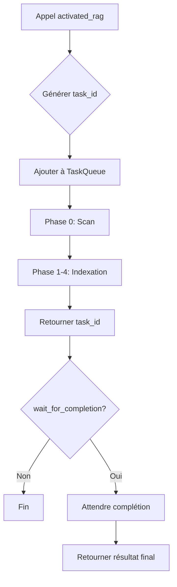

# 📜 Règles d'exécution RAG asynchrone

> **Règles strictes pour l'exécution asynchrone des tâches RAG**
>
> Version: 2.0.0 | Dernière mise à jour: 2026-01-14

---

## 🎯 Principes fondamentaux

### 1. Séparation des responsabilités

| Composant | Rôle | Interdictions |
|-----------|------|---------------|
| `ProgressTracker` | Suivi de progression | ❌ Pas de logique métier |
| `TaskQueue` | File d'attente par projet | ❌ Pas de stockage persistant |
| `index-rag` | Indexation asynchrone | ❌ Pas d'orchestration |
| `activated-rag` | Orchestration légère | ❌ Pas d'exécution directe |

### 2. JSON strict ou rien

**Toute communication MCP = JSON strict**

✅ **Autorisé:**

```json
{ "success": true, "task_id": "task-123" }
```

❌ **Interdit:**

```
[INFO] Tâche démarrée...
```

---

## 🔧 Architecture asynchrone

### 3. Pattern Task ID

**Toute tâche longue retourne un `task_id` immédiatement**

```typescript
// ✅ Bon
return {
    success: true,
    task_id: "task-123",
    status: { state: "queued" }
};

// ❌ Mauvais
return await indexProject(...); // Bloquant
```

### 4. File d'attente par projet

**Limites strictes:**

- Max 3 tâches par projet
- 1 tâche active par projet
- FIFO (First In, First Out)

### 5. Suivi de progression

**Champs obligatoires dans `ProgressStatus`:**

```typescript
interface ProgressStatus {
    state: 'queued' | 'running' | 'completed' | 'failed' | 'cancelled';
    step: string;
    progress: number; // 0-100
    filesProcessed: number;
    filesTotal: number;
    etaSeconds?: number;
    error?: TaskError;
    warnings: string[];
    estimatedEmbeddingCost?: EmbeddingCostEstimate;
}
```

---

## 🚀 Workflows autorisés

### 6. Workflow index_rag



### 7. Workflow activated_rag



---

## ⚠️ Règles de sécurité

### 8. Gestion des erreurs

**Toute erreur doit être capturée et loguée:**

```typescript
try {
    await executeTask();
} catch (error) {
    logger.error("module.task.error", "Message", {
        error: error.message,
        stack: error.stack,
        taskId
    });
    
    progressTracker.fail(taskId, error, 'step_name');
    throw error; // Propager pour TaskQueue
}
```

### 9. Timeouts

**Timeouts par défaut:**

- `index_rag`: 300 secondes
- `activated_rag`: 600 secondes
- `wait_for_completion`: Respecter le timeout utilisateur

### 10. Annulation propre

**Priorité d'annulation:**

1. Via `TaskQueue.cancel()` (si dans la file)
2. Via `ProgressTracker.cancel()` (si en cours)
3. Forcer avec `force: true` (dernier recours)

---

## 📊 Monitoring et logs

### 11. Structure de logs

**Format:**

```
[timestamp] [module.severity.action] Message {metadata}
```

**Exemple:**

```
2026-01-14T10:30:00Z [rag.index.task.start] Début indexation {taskId: "task-123", project: "/path"}
```

### 12. Métriques obligatoires

**À suivre pour chaque tâche:**

- Durée d'exécution
- Nombre de fichiers traités
- Coût estimé des embeddings
- État final (succès/échec/annulé)

---

## 🔄 Intégration MCP

### 13. Outils MCP obligatoires

**Tous les outils doivent être disponibles:**

- `index_rag` - Indexation asynchrone
- `activated_rag` - Orchestration asynchrone  
- `get_task_status` - Consultation progression
- `cancel_task` - Annulation tâche
- `list_tasks` - Liste tâches (bonus)

### 14. Schémas JSON stricts

**Validation automatique via JSON Schema:**

```json
{
    "$schema": "http://json-schema.org/draft-07/schema#",
    "type": "object",
    "properties": {
        "task_id": { "type": "string" },
        "status": { "$ref": "#/definitions/ProgressStatus" }
    },
    "required": ["task_id", "status"]
}
```

---

## 🧪 Tests et validation

### 15. Tests unitaires obligatoires

**À implémenter pour:**

- `ProgressTracker` (100% coverage)
- `TaskQueue` (100% coverage)
- Handlers MCP (scénarios principaux)

### 16. Tests d'intégration

**Scénarios à tester:**

- Workflow complet index_rag
- Workflow complet activated_rag
- Annulation de tâche
- Gestion des erreurs
- Timeouts

---

## 📚 Documentation

### 17. Documentation à jour

**Fichiers à maintenir:**

- `RAG_EXECUTION_RULES.md` (ce fichier)
- `GUIDE-NOUVEAUX-OUTILS-V2.md`
- JSDoc dans le code source
- Exemples d'utilisation

### 18. Exemples obligatoires

**Fournir dans `/examples/`:**

- Appel basique index_rag
- Appel avec wait_for_completion
- Consultation de statut
- Annulation de tâche

---

## ✅ Checklist de validation

### Avant tout commit

- [ ] Tâches retournent `task_id` immédiatement
- [ ] JSON strict dans toutes les réponses
- [ ] Logs structurés avec metadata
- [ ] Gestion d'erreurs complète
- [ ] Timeouts configurés
- [ ] Tests unitaires passants
- [ ] Documentation mise à jour

### Avant toute release

- [ ] Tests d'intégration passants
- [ ] Performance acceptable
- [ ] Backward compatibility vérifiée
- [ ] Guide utilisateur complet
- [ ] Exemples fonctionnels

---

## 🚨 Anti-patterns interdits

### ❌ **NE JAMAIS:**

1. **Exécuter du code bloquant dans un handler MCP**

   ```typescript
   // ❌ MAUVAIS
   export const handler: ToolHandler = async (args) => {
       const result = await longRunningTask(); // Bloquant!
       return { content: [{ type: "text", text: JSON.stringify(result) }] };
   };
   
   // ✅ BON
   export const handler: ToolHandler = async (args) => {
       const taskId = generateTaskId();
       taskQueue.enqueue(taskId, () => longRunningTask());
       return { content: [{ type: "text", text: JSON.stringify({ task_id: taskId }) }] };
   };
   ```

2. **Retourner du texte brut au lieu de JSON**
3. **Ignorer les erreurs sans les logger**
4. **Dépasser les limites de la file d'attente**
5. **Modifier ProgressTracker depuis l'extérieur du module**

---

## 🔗 Références

- [Architecture RAG asynchrone](./design/activated-rag-architecture.md)
- [Guide nouveaux outils V2](./GUIDE-NOUVEAUX-OUTILS-V2.md)
- [Code source ProgressTracker](./src/core/progress-tracker.ts)
- [Code source TaskQueue](./src/core/task-queue.ts)

---

**Mainteneurs:** Équipe RAG MCP Server  
**Contact:** Via issues GitHub  
**Dernière révision:** 2026-01-14  
**Prochaine révision:** 2026-02-14
