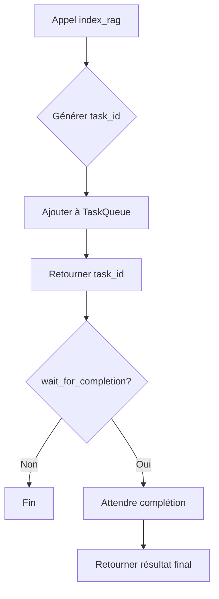
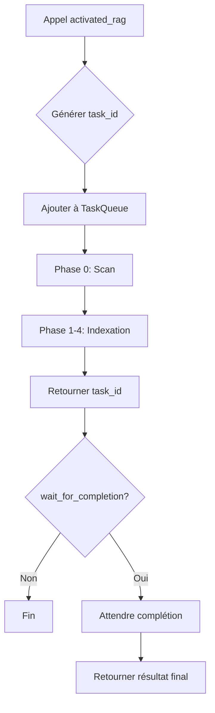
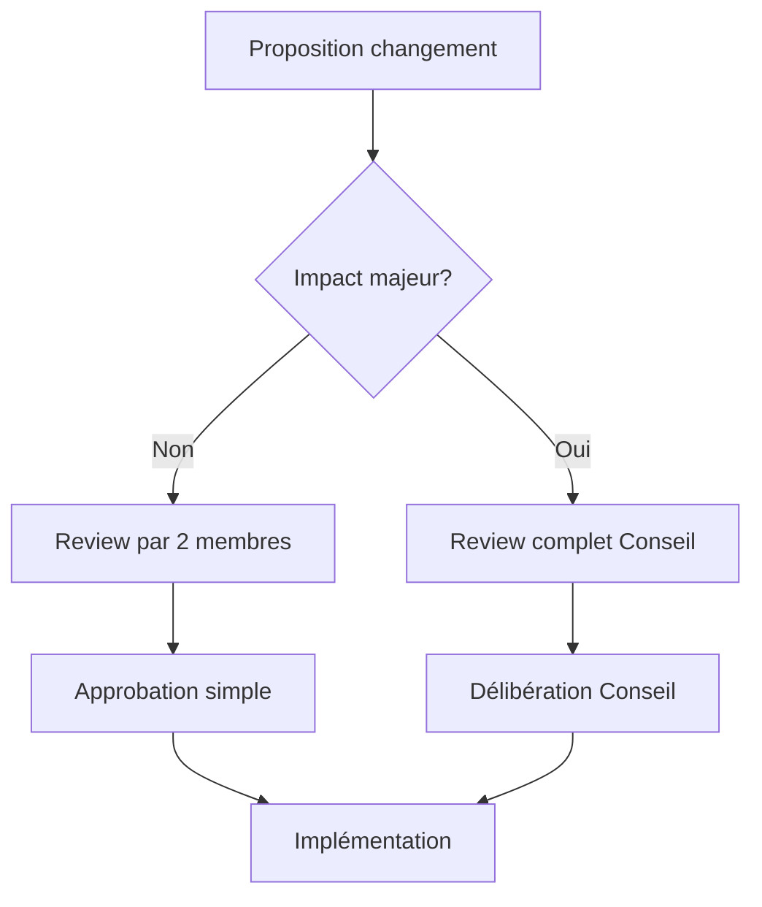

# 📜 Règles d'exécution RAG asynchrone

> **Règles strictes pour l'exécution asynchrone des tâches RAG**
>
> Version: 3.0.0 | Dernière mise à jour: 2026-01-16

---

## 🎯 Principes fondamentaux

### 1. Séparation des responsabilités

| Composant | Rôle | Interdictions |
|-----------|------|---------------|
| `ProgressTracker` | Suivi de progression | ❌ Pas de logique métier |
| `TaskQueue` | File d'attente par projet | ❌ Pas de stockage persistant |
| `index-rag` | Indexation asynchrone | ❌ Pas d'orchestration |
| `activated-rag` | Orchestration légère | ❌ Pas d'exécution directe |

### 2. JSON strict ou rien

**Toute communication MCP = JSON strict**

✅ **Autorisé:**

```json
{ "success": true, "task_id": "task-123" }
```

❌ **Interdit:**

```
[INFO] Tâche démarrée...
```

---

## 🔧 Architecture asynchrone

### 3. Pattern Task ID

**Toute tâche longue retourne un `task_id` immédiatement**

```typescript
// ✅ Bon
return {
    success: true,
    task_id: "task-123",
    status: { state: "queued" }
};

// ❌ Mauvais
return await indexProject(...); // Bloquant
```

### 4. File d'attente par projet

**Limites strictes:**

- Max 3 tâches par projet
- 1 tâche active par projet
- FIFO (First In, First Out)

### 5. Suivi de progression

**Champs obligatoires dans `ProgressStatus`:**

```typescript
interface ProgressStatus {
    state: 'queued' | 'running' | 'completed' | 'failed' | 'cancelled';
    step: string;
    progress: number; // 0-100
    filesProcessed: number;
    filesTotal: number;
    etaSeconds?: number;
    error?: TaskError;
    warnings: string[];
    estimatedEmbeddingCost?: EmbeddingCostEstimate;
}
```

---

## 🚀 Workflows autorisés

### 6. Workflow index_rag



### 7. Workflow activated_rag



---

## ⚠️ Règles de sécurité

### 8. Gestion des erreurs

**Toute erreur doit être capturée et loguée:**

```typescript
try {
    await executeTask();
} catch (error) {
    logger.error("module.task.error", "Message", {
        error: error.message,
        stack: error.stack,
        taskId
    });
    
    progressTracker.fail(taskId, error, 'step_name');
    throw error; // Propager pour TaskQueue
}
```

### 9. Timeouts

**Timeouts par défaut:**

- `index_rag`: 300 secondes
- `activated_rag`: 600 secondes
- `wait_for_completion`: Respecter le timeout utilisateur

### 10. Annulation propre

**Priorité d'annulation:**

1. Via `TaskQueue.cancel()` (si dans la file)
2. Via `ProgressTracker.cancel()` (si en cours)
3. Forcer avec `force: true` (dernier recours)

---

## 📊 Monitoring et logs

### 11. Structure de logs

**Format:**

```
[timestamp] [module.severity.action] Message {metadata}
```

**Exemple:**

```
2026-01-14T10:30:00Z [rag.index.task.start] Début indexation {taskId: "task-123", project: "/path"}
```

### 12. Métriques obligatoires

**À suivre pour chaque tâche:**

- Durée d'exécution
- Nombre de fichiers traités
- Coût estimé des embeddings
- État final (succès/échec/annulé)

---

## 🔄 Intégration MCP

### 13. Outils MCP obligatoires

**Tous les outils doivent être disponibles:**

- `index_rag` - Indexation asynchrone
- `activated_rag` - Orchestration asynchrone  
- `get_task_status` - Consultation progression
- `cancel_task` - Annulation tâche
- `list_tasks` - Liste tâches (bonus)

### 14. Schémas JSON stricts

**Validation automatique via JSON Schema:**

```json
{
    "$schema": "http://json-schema.org/draft-07/schema#",
    "type": "object",
    "properties": {
        "task_id": { "type": "string" },
        "status": { "$ref": "#/definitions/ProgressStatus" }
    },
    "required": ["task_id", "status"]
}
```

---

## 🧪 Tests et validation

### 15. Tests unitaires obligatoires

**À implémenter pour:**

- `ProgressTracker` (100% coverage)
- `TaskQueue` (100% coverage)
- Handlers MCP (scénarios principaux)

### 16. Tests d'intégration

**Scénarios à tester:**

- Workflow complet index_rag
- Workflow complet activated_rag
- Annulation de tâche
- Gestion des erreurs
- Timeouts

---

## 🔒 Gouvernance stricte

### 19. Conseil d'Architecture Évolutive

**Toute modification des règles doit être validée par le Conseil d'Architecture Évolutive**

#### Composition du Conseil

- Architecte principal RAG MCP Server
- Responsable qualité
- Représentant développement
- Expert IA/ML

#### Responsabilités

1. **Validation des changements de règles** : Approbation avant implémentation
2. **Review des refactorings majeurs** : Impact architecture évalué
3. **Gestion des exceptions** : Décisions sur cas particuliers
4. **Planification évolutive** : Roadmap technique alignée avec vision

#### Processus de décision



### 20. Code reviews obligatoires

**Tout commit doit être revu par au moins un autre développeur**

#### Checklist review

- [ ] Conformité aux règles d'architecture
- [ ] Aucun doublon de code créé
- [ ] Tests unitaires adéquats
- [ ] Documentation mise à jour
- [ ] Messages IA-first inclus
- [ ] Schémas MCP validés

#### Validation automatique

- CI/CD doit exécuter tous les tests
- Validation JSON Schema obligatoire
- Scan anti-doublons automatique

---

## 🗄️ Base vectore principale

### 21. Stratégie multi-environnements

**SQLite pour développement, vraie DB vectore pour production**

#### Environnement développement

```json
{
  "database": {
    "type": "sqlite",
    "mode": "local",
    "vector_extension": false
  }
}
```

#### Environnement production

```json
{
  "database": {
    "type": "postgres", // ou pinecone, weaviate, qdrant
    "mode": "remote",
    "vector_extension": true,
    "connection": { /* config spécifique */ }
  }
}
```

### 22. Migration obligatoire

**Scripts de migration doivent être fournis**

#### Migration SQLite → Production

1. **Export** : Script d'export des embeddings SQLite
2. **Transformation** : Adaptation format cible
3. **Import** : Chargement dans DB vectore production
4. **Validation** : Vérification intégrité données

#### Exemple de script

```bash
# Export depuis SQLite
node scripts/export-embeddings.js --source sqlite --output embeddings.json

# Import vers PostgreSQL
node scripts/import-embeddings.js --target postgres --input embeddings.json
```

### 23. Tests multi-backends

**Tous les composants doivent être testés avec au moins 2 backends**

```typescript
describe('VectorStore', () => {
  describe('SQLite backend', () => {
    test('semantic search', async () => {
      const store = VectorStoreFactory.create({ type: 'sqlite' });
      // tests...
    });
  });

  describe('PostgreSQL backend', () => {
    test('semantic search', async () => {
      const store = VectorStoreFactory.create({ type: 'postgres' });
      // tests...
    });
  });
});
```

---

## 📋 Checklist avant chaque commit

### 24. Validation complète

**À exécuter systématiquement avant tout commit**

```bash
# 1. Tests unitaires
npm run test:unit

# 2. Tests d'intégration
npm run test:integration

# 3. Validation JSON
npm run test:json-strict

# 4. Scan anti-doublons
npm run test:no-duplicates

# 5. Validation schémas MCP
npm run test:mcp-schemas

# 6. Vérification messages IA-first
npm run test:ia-first-messages
```

### 25. Vérifications manuelles

- [ ] **Aucun `console.log`** dans le code de production
- [ ] **Messages IA-first** : `notes_for_ai` et `allowed_actions` présents
- [ ] **Configuration unique** : Lecture depuis `rag-config-v3.json`
- [ ] **Outils MCP limités** : Pas de prolifération au-delà des 5 essentiels
- [ ] **Documentation** : Mise à jour des guides et exemples
- [ ] **Backward compatibility** : Pas de breaking change non documenté

---

## 📚 Documentation (mise à jour)

### 26. Documentation à jour

**Fichiers à maintenir:**

- `RAG_EXECUTION_RULES.md` (ce fichier) - v3.0.0
- `RAG_ARCHITECTURE_RULES.md` - v3.0.0
- `GUIDE-NOUVEAUX-OUTILS-V3.md` (à créer)
- `ANALYSE_HISTORIQUE_COMPLETE.md` - Synthèse historique
- JSDoc dans le code source
- Exemples d'utilisation

### 27. Exemples obligatoires (étendus)

**Fournir dans `/examples/`:**

- Appel basique `activated_rag`
- Appel avec `wait_for_completion`
- Consultation de statut avec `get_status`
- Annulation de tâche avec `cancel_task`
- Migration SQLite → PostgreSQL
- Configuration multi-environnements
- Tests multi-backends

---

## ✅ Checklist de validation

### Avant tout commit

- [ ] Tâches retournent `task_id` immédiatement
- [ ] JSON strict dans toutes les réponses
- [ ] Logs structurés avec metadata
- [ ] Gestion d'erreurs complète
- [ ] Timeouts configurés
- [ ] Tests unitaires passants
- [ ] Documentation mise à jour

### Avant toute release

- [ ] Tests d'intégration passants
- [ ] Performance acceptable
- [ ] Backward compatibility vérifiée
- [ ] Guide utilisateur complet
- [ ] Exemples fonctionnels

---

## 🚨 Anti-patterns interdits (étendus)

### ❌ **NE JAMAIS:**

1. **Exécuter du code bloquant dans un handler MCP**

   ```typescript
   // ❌ MAUVAIS
   export const handler: ToolHandler = async (args) => {
       const result = await longRunningTask(); // Bloquant!
       return { content: [{ type: "text", text: JSON.stringify(result) }] };
   };
   
   // ✅ BON
   export const handler: ToolHandler = async (args) => {
       const taskId = generateTaskId();
       taskQueue.enqueue(taskId, () => longRunningTask());
       return { content: [{ type: "text", text: JSON.stringify({ task_id: taskId }) }] };
   };
   ```

2. **Retourner du texte brut au lieu de JSON**
3. **Ignorer les erreurs sans les logger**
4. **Dépasser les limites de la file d'attente**
5. **Modifier ProgressTracker depuis l'extérieur du module**
6. **Créer des doublons de fichiers** (ex: `vector-store-refactored.ts`)
7. **Exposer plus de 5 outils MCP** sans validation Conseil
8. **Oublier les messages IA-first** (`notes_for_ai`, `allowed_actions`)
9. **Hardcoder la configuration** au lieu d'utiliser `rag-config-v3.json`
10. **Négliger les tests multi-backends** pour les composants vectoriels

---

## 🔗 Références (mise à jour)

- [Architecture RAG asynchrone](./design/activated-rag-architecture.md)
- [Règles d'architecture RAG MCP Server](./RAG_ARCHITECTURE_RULES.md) (v3.0.0)
- [Guide nouveaux outils V3](./GUIDE-NOUVEAUX-OUTILS-V2.md)
- [Règles absolues consolidées](./.clinerules/Règles_Absolues_Rag_Mcp_Server.md) (v2.0.0)
- [Synthèse historique complète](./ANALYSE_HISTORIQUE_COMPLETE.md)
- [Code source ProgressTracker](./src/core/progress-tracker.ts)
- [Code source TaskQueue](./src/core/task-queue.ts)
- [Code source VectorStoreFactory](./src/rag/vector-store-factory.ts)

---

**Mainteneurs:** Équipe RAG MCP Server  
**Contact:** Via issues GitHub  
**Dernière révision:** 2026-01-16  
**Prochaine révision:** 2026-03-16
