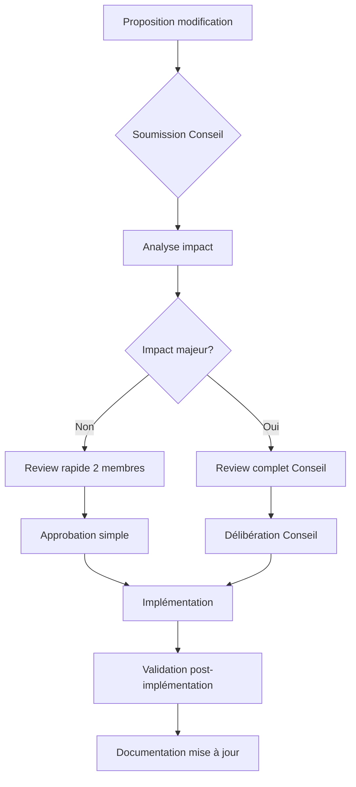
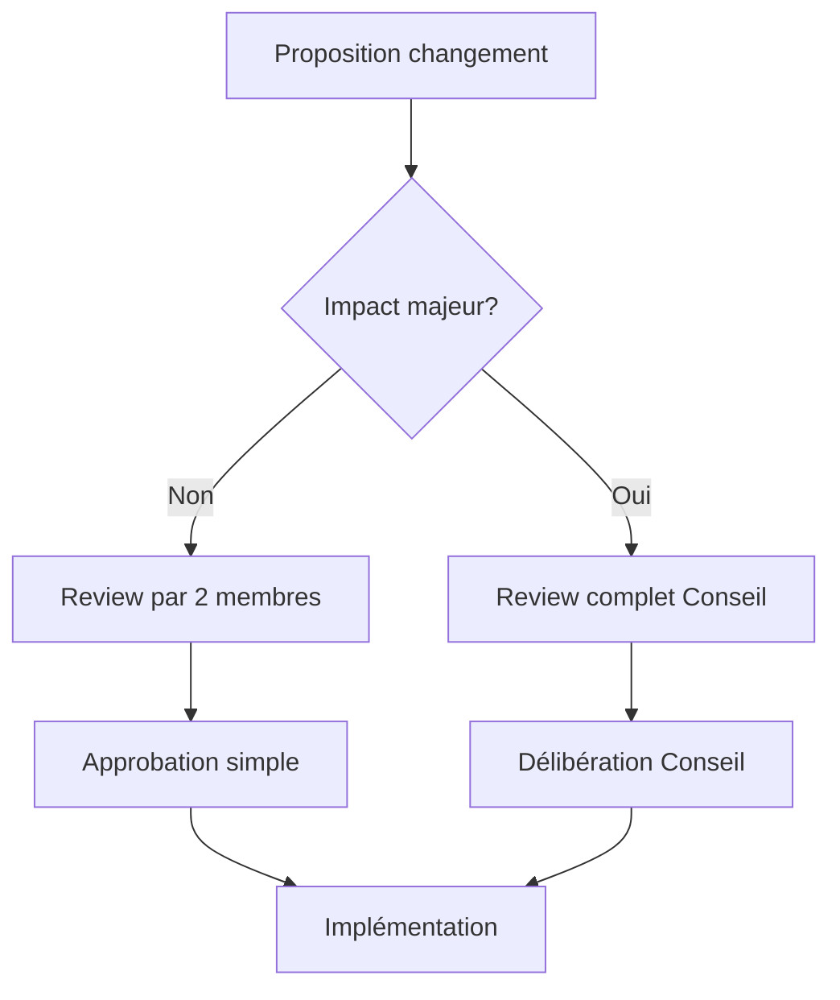

# 📜 Règles absolues pour développer un **RAG MCP Server**

> **Ce document définit les 14 règles NON NÉGOCIABLES** à respecter pour concevoir, développer et maintenir un système RAG (Retrieval-Augmented Generation) intégré à un **MCP Server**.
>
> Version: 3.0.0 | Dernière mise à jour: 2026-01-16
>
> ⚠️ **AVERTISSEMENT : VIOLATION CRITIQUE**
> Toute violation de ces règles absolues doit être signalée immédiatement
> et corrigée avant tout merge. Les violations répétées entraînent
> une revue d'architecture obligatoire par le Conseil d'Architecture Évolutive.

---

## 🔥 RÈGLE ABSOLUE #1 : Base décisionnelle immuable

### Principe

**Toute décision future concernant le RAG MCP Server doit impérativement se baser sur les règles existantes. Les règles elles-mêmes ne peuvent être modifiées qu'après revue officielle par le Conseil d'Architecture Évolutive.**

### Implications

1. **Stabilité garantie** : Pas de changement arbitraire d'architecture
2. **Cohérence maintenue** : Tous les développements suivent les mêmes principes
3. **Évolutivité contrôlée** : Les évolutions sont planifiées et validées
4. **Rétrocompatibilité** : Les changements ne cassent pas les implémentations existantes

### Processus de modification



### Exemples d'application

- ✅ **Autorisé** : Implémenter une nouvelle fonctionnalité selon les règles existantes
- ❌ **Interdit** : Changer l'ordre du pipeline RAG sans validation Conseil
- ❌ **Interdit** : Ajouter un backend hardcodé sans passer par la configuration
- ❌ **Interdit** : Créer des doublons de fichiers sans fusion/archivage

---

## 🔥 RÈGLE ABSOLUE #2 : Séparation stricte des responsabilités

### Principe

**Un module = une responsabilité = un contrat clair**

### Rôles et interdictions

| Élément        | Rôle                  | Interdiction absolue          |
| -------------- | --------------------- | ----------------------------- |
| `init_rag`     | Initialisation projet | ❌ Aucune exécution RAG        |
| `activate_rag` | Pipeline RAG runtime  | ❌ Aucune création de fichiers |
| MCP Server     | Orchestration         | ❌ Log texte dans stdout       |
| LLM (Ollama)   | Raisonnement          | ❌ Accès direct aux fichiers   |

### Conséquences

- `init_rag` crée uniquement les répertoires, fichiers de config et bases SQLite vides
- `activate_rag` vérifie l'initialisation puis exécute le pipeline RAG complet
- Tout accès filesystem passe par des outils MCP dédiés

---

## 🔥 RÈGLE ABSOLUE #3 : JSON strict ou rien

### Principe

**Toutes les réponses MCP et données métier doivent respecter JSON strict.**

### Interdictions absolues

- ❌ Icônes dans les champs métier (`result`, `status`, `metadata`, etc.)
- ❌ Décorations textuelles
- ❌ Commentaires inline
- ❌ Formatage non-JSON

### Exceptions autorisées

- ✅ Champs dédiés à l'IA (`notes_for_ai`, `allowed_actions`, `next_steps`) peuvent contenir des icônes ou symboles
- ✅ Logs destinés à l'humain (`stderr` ou `.log`) peuvent être enrichis

### Objectif

- Interopérabilité totale entre MCP et agents IA
- Validation automatique possible
- Compatibilité avec pipelines automatisés

### ✅ Format autorisé

```json
{
  "status": "success",
  "result": { "files_indexed": 42 },
  "notes_for_ai": "📊 Indexation terminée pour 42 fichiers.",
  "allowed_actions": ["query_rag", "get_status"],
  "next_steps": ["Exécuter query_rag pour recherche"]
}
```

### ❌ Formats interdits

```json
{
  "status": "✅ success",
  "result": { "📁 files": 42 },
  "message": "[INFO] Traitement terminé"
}
```

### Logging séparé

| Flux      | Contenu                 | Destination          |
| --------- | ----------------------- | -------------------- |
| `stdout`  | JSON machine uniquement | MCP Client           |
| `stderr`  | erreurs techniques + logs humains enrichis | Terminal |
| `rag.log` | logs humains structurés | Fichier de log       |

---

## 🔥 RÈGLE ABSOLUE #4 : Architecture RAG obligatoire

### Structure de fichiers standard

```text
/rag/
 ├─ db/
 │   ├─ memory.sqlite
 │   ├─ vectors.sqlite
 │   └─ metadata.sqlite
 │
 ├─ config/
 │   ├─ rag.config.json
 │   ├─ db.config.json
 │   └─ embedding.config.json
 │
 ├─ logs/
 │   └─ rag.log
 │
 ├─ .ragignore
 └─ state.json
```

🚫 Aucun autre emplacement n'est autorisé

### Rôle EXCLUSIF de `init_rag`

`init_rag` **DOIT** :

1. Créer les répertoires `/rag/db` et `/rag/config`
2. Générer les fichiers de configuration par défaut
3. Initialiser les bases SQLite (tables vides)
4. Créer `.ragignore`
5. Enregistrer le projet dans la mémoire MCP
6. Retourner **UN SEUL JSON FINAL**

🚫 `init_rag` ne doit JAMAIS :

- analyser des fichiers
- générer des embeddings
- appeler un LLM

### Rôle EXCLUSIF de `activate_rag`

`activate_rag` **DOIT** :

1. Vérifier que `init_rag` a été exécuté
2. Charger la configuration
3. Exécuter le pipeline RAG :

   - Analyse
   - Chunking
   - Embeddings
   - Indexation
   - Retrieval

🚫 `activate_rag` ne doit JAMAIS :

- créer de fichiers système
- modifier la configuration

### Pipeline RAG — Ordre NON modifiable

```text
1. Scan fichiers
2. Filtrage (.ragignore)
3. Analyse structurelle
4. (Optionnel) Analyse LLM
5. Chunking
6. Embeddings
7. Indexation
8. Retrieval
```

🚫 Changer l'ordre = RAG instable

### Gestion d'état obligatoire

**`state.json` obligatoire** contient :

- version RAG
- backend DB
- état d'indexation
- date dernière mise à jour

---

## 🔥 RÈGLE ABSOLUE #5 : Base de données configurable uniquement

### Backend par défaut

```json
{
  "type": "sqlite",
  "mode": "local",
  "vector_extension": false
}
```

📌 PostgreSQL est **OPTIONNEL**, jamais hardcodé

### Interdictions absolues

- ❌ Aucun backend hardcodé
- ❌ Aucun `if (postgres)` dans le code
- ❌ Aucune dépendance système obligatoire

👉 Le backend est **CHOISI UNIQUEMENT via config**

### Stratégie multi-environnements

**SQLite pour développement, vraie DB vectore pour production**

#### Environnement développement

```json
{
  "database": {
    "type": "sqlite",
    "mode": "local",
    "vector_extension": false
  }
}
```

#### Environnement production

```json
{
  "database": {
    "type": "postgres", // ou pinecone, weaviate, qdrant
    "mode": "remote",
    "vector_extension": true,
    "connection": { /* config spécifique */ }
  }
}
```

### Migration obligatoire

**Scripts de migration doivent être fournis** pour SQLite → Production

---

## 🔥 RÈGLE ABSOLUE #6 : LLM & MCP — Règles d'or

### Ollama (ou autre LLM)

- ❌ N'analyse JAMAIS de fichiers directement
- ❌ Ne lit PAS le filesystem
- ✅ Reçoit UNIQUEMENT :

  - texte
  - JSON
  - chunks préparés

👉 Toute analyse de fichier passe par un **outil MCP**

### Analyse poussée par LLM (optionnelle)

```json
"deep_llm_analysis": false
```

- Désactivée par défaut
- Activée explicitement
- Exécutée **AVANT embeddings**
- Jamais bloquante

### Minimalisme MCP

**Limiter aux outils essentiels (5 maximum)**

| Outil | Rôle | Statut |
|-------|------|--------|
| `activated_rag` | Orchestration pipeline | Obligatoire |
| `get_status` | Consultation progression | Obligatoire |
| `query_rag` | Recherche sémantique | Obligatoire |
| `cancel_task` | Annulation tâche | Optionnel |
| `list_tasks` | Liste tâches | Optionnel |

### Messages IA-first

**Toute réponse MCP doit être optimisée pour interprétation IA**

```json
{
  "status": "success",
  "result": { /* données métier */ },
  "notes_for_ai": "Explication structurée pour l'IA",
  "allowed_actions": ["action1", "action2"],
  "next_steps": ["étape suggérée"]
}
```

### Schémas MCP complets

**Tout outil MCP doit avoir des schémas input/output validés**

```typescript
// src/core/mcp-schemas.ts
export const activatedRagSchema = {
  input: { /* schéma JSON Schema */ },
  output: { /* schéma JSON Schema */ },
  examples: [ /* exemples valides */ ]
};
```

---

## 🔥 RÈGLE ABSOLUE #7 : Usage unique des commandes MCP

### Principe

**`init_rag` et `activated_rag` = 1 seule exécution par projet**

### Implications

- `init_rag` : Initialisation unique du projet
- `activated_rag` : Activation unique du pipeline RAG
- Toute répétition = erreur critique `command_already_executed`

### Mécanisme de vérification

1. **État projet** : Vérifier `state.json` et flags internes
2. **Verrouillage** : Bloquer toute ré-exécution
3. **Message d'erreur** : Retourner erreur claire avec code spécifique

### ✅ Exemple autorisé

```json
{
  "status": "success",
  "message": "init_rag exécuté avec succès",
  "project_id": "proj-123"
}
```

### ❌ Exemple interdit (répétition)

```json
{
  "status": "error",
  "code": "command_already_executed",
  "message": "init_rag a déjà été exécuté pour ce projet",
  "suggestion": "Utilisez get_status pour vérifier l'état actuel"
}
```

---

## 🔥 RÈGLE ABSOLUE #8 : Ordre et séquence normalisée des outils MCP

### Principe

**Séquence stricte et validation d'ordre pour tous les outils MCP**

### Séquence obligatoire

```text
1. init_rag (une fois)
2. activated_rag (une fois)
3. get_status (illimité)
4. query_rag (illimité)
5. cancel_task (si nécessaire)
```

### Validations requises

- ✅ `activated_rag` nécessite `init_rag` exécuté
- ✅ `query_rag` nécessite pipeline actif
- ✅ `get_status` toujours disponible
- ❌ Pas de saut d'étape
- ❌ Pas de répétition inutile

### Implémentation

- Guards (`requireInit`, `requireActive`, etc.)
- Validation automatique avant exécution
- Messages d'erreur contextuels

---

## 🔥 RÈGLE ABSOLUE #9 : Processus background sans timeout artificiel

### Principe

**Aucun timeout, setTimeout, AbortController ou délai artificiel sur les processus RAG**

### Interdictions absolues

- ❌ Pas de `timeout` configuré
- ❌ Pas de `setTimeout` pour interruption
- ❌ Pas de `AbortController` avec délai
- ❌ Pas de kill automatique des tâches longues

### Alternatives obligatoires

- ✅ Processus vivent jusqu'à complétion
- ✅ Annulation explicite uniquement via `cancel_task`
- ✅ Reprise après crash via checkpoints
- ✅ Gouvernance par état, pas par timeout

### Raison

- Incompatible avec indexation lourde
- Incompatible avec embeddings massifs
- Nécessaire pour reprise après crash
- Essentiel pour gouvernance IA

---

## 🔥 RÈGLE ABSOLUE #10 : Affichage temps réel et logs séparés

### Principe

**JSON strict pour MCP + affichage humain enrichi pour monitoring**

### Flux séparés obligatoires

| Flux | Contenu | Destination | Format |
|------|---------|-------------|--------|
| `stdout` | Réponses MCP | Client MCP | JSON strict |
| `stderr` | Progression humaine | Terminal | Texte enrichi |
| `rag.log` | Logs structurés | Fichier | JSON structuré |

### Exemple d'implémentation

```typescript
// JSON pour MCP (stdout)
console.log(JSON.stringify({
  status: "running",
  progress: 45,
  task_id: "task-123"
}));

// Affichage humain (stderr)
console.error(`📊 Progression: 45% | Fichiers: 42/100 | ETA: 5min`);
```

### Options `get_status`

```json
{
  "task_id": "task-123",
  "format": "human" // ou "json" (défaut)
}
```

---

## 🔥 RÈGLE ABSOLUE #11 : Cache mémoire et récupération contexte

### Principe

**Cache mémoire persistant + récupération automatique du contexte Cline**

### Composants obligatoires

1. **Cache embeddings** : Stockage temporaire des embeddings calculés
2. **Cache chunks** : Chunks analysés et préparés
3. **Cache requêtes** : Historique des recherches sémantiques
4. **Mémoire décisions IA** : Raisonnements et décisions précédentes
5. **Contexte Cline** : Chat courant + historique automatiquement injecté

### Implémentation

- Stockage SQLite dédié (`/rag/db/memory.sqlite`)
- Expiration contrôlée (TTL configurable)
- Consultation via `get_status`
- Injection automatique dans pipeline RAG

### Bénéfices

- Réduction redondance calculs
- Amélioration performance
- Continuité raisonnement IA
- Contexte projet préservé

---

## 🔥 RÈGLE ABSOLUE #12 : Automatisation en boucle continue

### Principe

**Pipeline RAG automatisé fonctionnant en boucle ou par déclenchement événementiel**

### Modes d'exécution

1. **Boucle continue** : Scan → Analyse → Embedding → Indexation → (repeat)
2. **Déclenchement événement** : Modification fichier → re-indexation partielle
3. **Déclenchement état** : État changement → action appropriée

### Règles strictes

- ✅ Pas de rappel de `init_rag` ou `activated_rag`
- ✅ Utilisation état, cache, mémoire
- ✅ Reprise interne sans intervention
- ✅ Non-bloquant pour autres opérations

### Architecture

- Observateurs fichiersystem
- File d'attente prioritaire
- Traitement par lots optimisé
- Checkpoints réguliers

---

## 🔥 RÈGLE ABSOLUE #13 : Observabilité totale et logs structurés

### Principe

**Visibilité complète sur tous les processus internes, phases, et décisions**

### Données à observer

1. **Progression phase par phase** : Scan, filtrage, analyse, chunking, embedding, indexation
2. **Sous-processus** : Traitement fichiers individuels, batches
3. **Mémoire/cache** : État cache, hits/misses, expiration
4. **Erreurs partielles** : Fichiers échoués avec raison
5. **Décisions IA** : Raisonnements LLM, choix d'implémentation

### Format logs

```json
{
  "timestamp": "2026-01-16T07:30:00Z",
  "module": "rag.observability",
  "action": "phase_complete",
  "status": "success",
  "metadata": {
    "phase": "embedding",
    "files_processed": 42,
    "duration_seconds": 120
  }
}
```

### Implémentation

- Logs structurés en JSON
- Agrégation automatique des métriques
- Consultation via `get_status` avec option `detailed: true`
- Alertes configurables sur anomalies

---

## 🔥 RÈGLE ABSOLUE #14 : Gouvernance stricte et Conseil d'Architecture Évolutive

### Principe

**Toute modification des règles doit être validée par le Conseil d'Architecture Évolutive**

### Composition du Conseil

- Architecte principal RAG MCP Server
- Responsable qualité
- Représentant développement
- Expert IA/ML

### Responsabilités

1. **Validation des changements de règles** : Approbation avant implémentation
2. **Review des refactorings majeurs** : Impact architecture évalué
3. **Gestion des exceptions** : Décisions sur cas particuliers
4. **Planification évolutive** : Roadmap technique alignée avec vision

### Processus de décision



### Code reviews obligatoires

**Tout commit doit être revu par au moins un autre développeur**

#### Checklist review

- [ ] Conformité aux 14 règles absolues
- [ ] Aucun doublon de code créé
- [ ] Tests unitaires adéquats
- [ ] Documentation mise à jour
- [ ] Messages IA-first inclus
- [ ] Schémas MCP validés

---

## 🔥 RÈGLE ABSOLUE #15 : Non-réentrance stricte des commandes MCP

### Principe

**Une commande MCP à usage unique ne doit jamais être relançable, même indirectement (boucle, retry, crash, redémarrage).**

### Interdictions absolues

- ❌ Retry automatique après échec
- ❌ Relance via boucle d'automatisation
- ❌ Relance après crash système
- ❌ Relance après redémarrage serveur
- ❌ Bypass via outils MCP alternatifs

### Mécanisme de garantie

1. **État persistant** : `command_executed=true` stocké dans `state.json`
2. **Verrouillage système** : Vérification avant toute exécution
3. **Refus catégorique** : Retour d'erreur `command_already_executed` avec code spécifique
4. **Persistance crash** : État survit aux redémarrages

### Implication

- C'est une **règle système**, pas seulement fonctionnelle
- La non-réentrance est **garantie par l'architecture**, pas par convention

---

## 🔥 RÈGLE ABSOLUE #16 : JSON MCP unique par stdout

### Principe

**Un outil MCP ne doit jamais émettre plusieurs JSON métier successifs sur stdout.**

### Norme stricte

- ✅ **1 JSON final** = réponse MCP contractuelle unique
- ❌ **Pas de JSON intermédiaires** sur stdout
- ❌ **Pas de "progress JSON"** sur stdout
- ❌ **Pas de streaming JSON** sur stdout

### Alternatives obligatoires

- **Progression** : Via `stderr` (texte enrichi) ou `rag.log` (JSON structuré)
- **État intermédiaire** : Consultation via `get_status`
- **Streaming** : Interdit sur stdout MCP

### Raison

- Éviter la **cassure MCP / client / IA**
- Garantir **1 requête = 1 réponse**
- Préserver la **sémantique contractuelle** des outils MCP

---

## 🔥 RÈGLE ABSOLUE #17 : Séparation stricte JSON métier / JSON log

### Principe

**Un JSON de log n'est PAS un JSON MCP.**

### Distinctions obligatoires

| Type | Destination | Rôle | Format |
|------|-------------|------|--------|
| **JSON MCP** | `stdout` | Réponse contractuelle | Schéma validé, 1 seul par exécution |
| **JSON log** | `rag.log` | Observabilité | Structure libre, multiples autorisés |
| **JSON état** | `get_status` | Consultation état | Schéma spécifique |

### Interdictions absolues

- ❌ Jamais interchanger JSON MCP et JSON log
- ❌ Jamais réutiliser un JSON log comme réponse MCP
- ❌ Jamais parser un JSON MCP comme log
- ❌ Jamais mélanger les flux

### Implication

- **Séparation architecturale** des responsabilités
- **Validation distincte** pour chaque type
- **Outils dédiés** pour chaque usage

---

## 🔥 RÈGLE ABSOLUE #18 : Immutabilité de l'état RAG

### Principe

**`state.json` ne peut être modifié que par le moteur RAG, jamais par un agent, LLM ou outil externe.**

### Règles strictes

- ❌ **Pas d'édition manuelle** de `state.json`
- ❌ **Pas de "fix IA"** modifiant l'état
- ❌ **Pas de reset implicite** sans trace
- ❌ **Pas de correction externe** de l'état

### Processus autorisés

- ✅ **Moteur RAG** : Modifications pendant exécution pipeline
- ✅ **Checkpoints** : Sauvegarde état pendant traitement
- ✅ **Reprise crash** : Restauration depuis checkpoint

### Traçabilité obligatoire

- Toute mutation = **log structuré** dans `rag.log`
- Toute modification = **timestamp + raison + auteur (système)**
- État précédent = **archivage automatique** avant modification

---

## 🔥 RÈGLE ABSOLUE #19 : IA ≠ décision architecturale

### Principe

**Un LLM ne prend JAMAIS de décision architecturale.**

### Rôles autorisés (IA)

- ✅ **Proposer** des améliorations
- ✅ **Analyser** des problèmes
- ✅ **Suggérer** des solutions
- ✅ **Expliquer** des concepts

### Rôles interdits (IA)

- ❌ **Choisir** backend (SQLite, PostgreSQL, etc.)
- ❌ **Modifier** l'ordre du pipeline RAG
- ❌ **Changer** les règles absolues
- ❌ **Réordonner** les phases
- ❌ **Décider** de l'architecture système

### Gouvernance

- Décision architecturale = **Conseil d'Architecture Évolutive**
- Suggestion IA = **input pour décision humaine/système**
- Validation = **Processus formel** pas automatique

---

## 🔥 RÈGLE ABSOLUE #20 : Réentrance des sous-fonctions internes

### Principe

**Les sous-fonctions internes (scan, chunk, embedding…) doivent être réentrantes et idempotentes.**

### Distinction critique

- ❌ **Commandes MCP globales** = NON réentrantes (R15)
- ✅ **Sous-fonctions internes** = RÉENTRANTES et IDEMPOTENTES

### Exigences

1. **Survie crash** : Reprise depuis dernier checkpoint
2. **Idempotence** : Exécution multiple = même résultat
3. **Isolation** : Pas d'effets de bord non contrôlés
4. **État partiel** : Gestion état intermédiaire

### Implémentation

- **Checkpoints** par sous-fonction
- **Journalisation** des étapes
- **Validation** avant/après exécution
- **Nettoyage** état corrompu

---

## 🔥 RÈGLE ABSOLUE #21 : Contexte Cline en lecture seule

### Principe

**Le contexte Cline est injecté en lecture seule.**

### Droits stricts

- ✅ **Lecture** : Accès complet au contexte
- ✅ **Injection** : Intégration dans pipeline
- ✅ **Utilisation** : Amélioration raisonnement
- ❌ **Écriture** : Modification de l'historique
- ❌ **Correction** : "Fix" du passé
- ❌ **Réécriture** : Altération mémoire

### Protection

- **Snapshot** : Capture au moment de l'injection
- **Immutable** : Pas de modification post-injection
- **Trace** : Log de l'utilisation contexte
- **Validation** : Vérification intégrité avant utilisation

### Raison

- **Intégrité historique** : Préservation vérité
- **Reproductibilité** : Même contexte = même résultats
- **Auditabilité** : Traçabilité des décisions

---

## 🔥 RÈGLE ABSOLUE #22 : Zéro effet de bord non déclaré

### Principe

**Aucune commande MCP ne doit produire d'effet non déclaré.**

### Effets interdits (non déclarés)

- ❌ **Création fichier cachée**
- ❌ **Écriture DB hors pipeline**
- ❌ **Modification config silencieuse**
- ❌ **Changement état système**
- ❌ **Side-effects non loggés**

### Déclaration obligatoire

- **Documentation** : Effets documentés dans schéma MCP
- **Logging** : Tout effet = trace dans `rag.log`
- **Validation** : Vérification avant exécution
- **Transparence** : Effets visibles via `get_status`

### Implémentation

- **Audit** automatique des effets
- **Isolation** des opérations
- **Rollback** des effets non autorisés
- **Alertes** sur effets non déclarés

---

## 🔥 RÈGLE ABSOLUE #23 : Versionnage runtime obligatoire

### Principe

**Chaque exécution RAG doit être liée à une version explicite des règles.**

### Données obligatoires dans `state.json`

```json
{
  "rules_version": "3.0.0",
  "architecture_version": "3.0.0",
  "execution_id": "rag-1736845200-x91",
  "compatibility_check": {
    "rules_compatible": true,
    "architecture_compatible": true,
    "last_check": "2026-01-16T07:30:00Z"
  }
}
```

### Vérifications

1. **Démarrage** : Validation compatibilité versions
2. **Exécution** : Vérification cohérence runtime
3. **Crash** : Diagnostic incompatibilité versions
4. **Reprise** : Restauration version compatible

### Incohérence version

- **Warning critique** : Log niveau ERROR
- **Blocage optionnel** : Configuration `strict_versioning`
- **Report** : Notification Conseil d'Architecture

---

## 🔥 RÈGLE ABSOLUE #24 : IA ≠ humain (sorties dédiées)

### Principe

**Un agent IA ne reçoit jamais une sortie pensée pour un humain.**

### Distinctions strictes

| Destinataire | Format | Contenu | Exemple |
|--------------|--------|---------|---------|
| **IA** | JSON structuré | Données parsables, actions claires | `{"allowed_actions": ["get_status"]}` |
| **Humain** | Texte enrichi | Explications, émotions, contexte | `📊 Progression: 45%` |

### Interdictions (sorties IA)

- ❌ **Emojis** (sauf champ dédié `notes_for_ai`)
- ❌ **Texte narratif** ambigu
- ❌ **Explications longues** non structurées
- ❌ **Ambiguïté** sémantique

### Exigences (sorties IA)

- ✅ **Déterministe** : Même entrée = même sortie
- ✅ **Parsable** : Structure JSON validée
- ✅ **Contractuel** : Respect schémas MCP
- ✅ **Actionnable** : Actions claires dans `allowed_actions`

### Implémentation

- **Filtrage** automatique contenu humain
- **Validation** schémas sortie IA
- **Transformation** si nécessaire
- **Logging** des incohérences

---

## 🚨 Règles de survie (synthèse)

- 🧠 **Un LLM ne fait PAS du système**
- 🗂️ **Le filesystem n'est jamais implicite**
- 📄 **JSON strict ou crash**
- 🔌 **Pas de service externe obligatoire**
- 🧱 **Initialisation ≠ Exécution**
- 🔥 **Aucune duplication de code** (fusionner ou archiver)
- 🎯 **Messages IA-first obligatoires**
- ⚙️ **Configuration unique v3** (source de vérité)
- 🧪 **Tests multi-backends obligatoires**
- 🔒 **Usage unique des commandes MCP**
- ⏱️ **Pas de timeout sur processus background**
- 🔄 **Automatisation en boucle continue**
- 📊 **Observabilité totale obligatoire**
- 🏛️ **Gouvernance par Conseil d'Architecture**

---

## ✅ Conclusion

> Un RAG MCP Server est un **système distribué**, pas un script.

Respecter ces 14 règles absolues garantit :

- **Stabilité** : Pas de crash inattendu
- **Auditabilité** : Tout est traçable et loggé
- **Extensibilité** : Nouveaux backends, nouvelles phases
- **Maintenabilité** : Bugs localisables et corrigeables
- **Interopérabilité** : Compatible avec tout client MCP
- **Qualité IA** : Messages structurés, pilotage automatique
- **Zéro hallucination structurelle** : Architecture prévisible
- **Gouvernance** : Évolutions contrôlées et validées

🚀 **Toute implémentation future DOIT se conformer à ce document.**

---

**Mainteneurs:** Équipe RAG MCP Server  
**Contact:** Via issues GitHub  
**Dernière révision:** 2026-01-16  
**Prochaine révision:** 2026-03-16  
**Statut:** **ACTIF** - Conformité obligatoire pour tout nouveau développement
