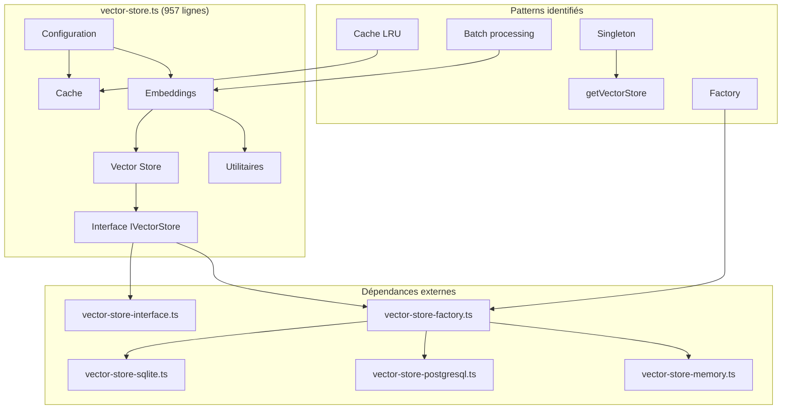

# Phase 1.1 : Analyse détaillée de `src/rag/vector-store.ts`

**Date** : 17/01/2026
**Tâche** : task-2218
**Complexité fichier** : 1.0 (max)
**Qualité** : 0.06 (très basse)
**Lignes** : 957
**Fonctions** : 35

## 📊 Vue d'ensemble

### Métriques SQLite (`audit/code_map.db`)

```sql
-- Fichier le plus problématique du projet
SELECT path, complexity, quality, lines FROM files
WHERE path = 'src/rag/vector-store.ts';

-- Résultat :
-- src/rag/vector-store.ts | 1.0 | 0.06 | 957
```

### Violations règles absolues

- **R4** : Une responsabilité par fichier ❌ (35 fonctions = fourre-tout)
- **R5** : Fonctions > 50 lignes ❌ (8 fonctions > 50 lignes)
- **R3** : JSON strict ? À vérifier dans logs
- **R25** : Anti-duplication ? À vérifier

## 🏗️ Architecture actuelle

### Imports

```typescript
import { SearchResult } from "./types.js";
import {
  createVectorStore,
  createVectorStoreForProject,
} from "./vector-store-factory.js";
import {
  IVectorStore,
  VectorStoreConfig,
  VectorStoreLogger,
} from "./vector-store-interface.js";
```

### Dépendances

```
vector-store.ts
├── vector-store-interface.ts (interface abstraite)
├── vector-store-factory.ts (factory pattern)
└── types.js (types communs)
```

## 📋 Classification des 35 fonctions

### Catégorie 1 : Configuration (4 fonctions)

| Fonction                 | Lignes | Visibilité | Responsabilité                                   |
| ------------------------ | ------ | ---------- | ------------------------------------------------ |
| `getVectorStore()`       | 15     | privée     | Singleton pattern, obtient instance IVectorStore |
| `configureVectorStore()` | 10     | exportée   | Configure explicitement le vector store          |
| `setEmbeddingProvider()` | 27     | exportée   | Configure provider + modèles multi-modèles       |
| `setEmbeddingModels()`   | 10     | exportée   | Met à jour modèles d'embeddings                  |

### Catégorie 2 : Cache embeddings (6 fonctions)

| Fonction                   | Lignes | Visibilité | Responsabilité                      |
| -------------------------- | ------ | ---------- | ----------------------------------- |
| `getCacheKey()`            | 14     | privée     | Génère clé unique pour cache        |
| `getCachedEmbedding()`     | 26     | privée     | Récupère embedding depuis cache LRU |
| `cacheEmbedding()`         | 30     | privée     | Met embedding en cache avec TTL     |
| `clearEmbeddingCache()`    | 10     | exportée   | Vide complètement le cache          |
| `getEmbeddingCacheStats()` | 24     | exportée   | Retourne statistiques cache         |
| `simpleHash()`             | 13     | privée     | Fonction de hachage simple          |

### Catégorie 3 : Génération embeddings (11 fonctions)

| Fonction                                 | Lignes | Visibilité | Responsabilité                         |
| ---------------------------------------- | ------ | ---------- | -------------------------------------- |
| `getEmbeddingModelForContentType()`      | 37     | exportée   | Routage modèle par type contenu        |
| `getEmbeddingDimensionForModel()`        | 15     | exportée   | Obtient dimension attendue pour modèle |
| `normalizeL2()`                          | 11     | privée     | Normalisation vecteur L2               |
| `generateFakeEmbedding()`                | 18     | privée     | Génère embedding factice amélioré      |
| `generateOllamaEmbedding()`              | 44     | privée     | Embedding via API Ollama (batch)       |
| `processOllamaBatch()`                   | 71     | privée     | Traite batch requêtes Ollama           |
| `processIndividualOllamaRequests()`      | 57     | privée     | Fallback requêtes individuelles        |
| `generateSentenceTransformerEmbedding()` | 9      | privée     | Placeholder Sentence Transformers      |
| `generateEmbeddingForContent()`          | 38     | privée     | Routage automatique type contenu       |
| `generateEmbeddingWithModel()`           | 15     | privée     | Génération avec modèle spécifique      |
| `generateEmbedding()`                    | 9      | exportée   | Compatibilité ancien code              |

### Catégorie 4 : Opérations vector store (12 fonctions)

| Fonction                     | Lignes | Visibilité | Responsabilité                         |
| ---------------------------- | ------ | ---------- | -------------------------------------- |
| `embedAndStore()`            | 73     | exportée   | Stocke document + embedding            |
| `semanticSearch()`           | 60     | exportée   | Recherche sémantique                   |
| `getProjectStats()`          | 21     | exportée   | Statistiques projet                    |
| `listProjects()`             | 13     | exportée   | Liste projets indexés                  |
| `deleteDocument()`           | 15     | exportée   | Supprime document par ID               |
| `clearAll()`                 | 16     | exportée   | Vide tous documents (tests)            |
| `getStats()`                 | 19     | exportée   | Statistiques globales store            |
| `testConnection()`           | 13     | exportée   | Test connectivité                      |
| `updateDocument()`           | 22     | exportée   | Met à jour document existant           |
| `hybridSearch()`             | 42     | exportée   | Recherche hybride (sémantique + texte) |
| `searchByMetadata()`         | 40     | exportée   | Recherche par métadonnées              |
| `deleteDocumentsByPattern()` | 15     | exportée   | Suppression par pattern                |

### Catégorie 5 : Gestion cycle de vie (2 fonctions)

| Fonction       | Lignes | Visibilité | Responsabilité          |
| -------------- | ------ | ---------- | ----------------------- |
| `initialize()` | 14     | exportée   | Initialise vector store |
| `close()`      | 19     | exportée   | Fermeture propre        |

## 🔍 Violations R5 (fonctions > 50 lignes)

### 8 fonctions trop longues

1. `processOllamaBatch()` - 71 lignes ❌
2. `processIndividualOllamaRequests()` - 57 lignes ❌
3. `embedAndStore()` - 73 lignes ❌
4. `semanticSearch()` - 60 lignes ❌
5. `generateOllamaEmbedding()` - 44 lignes ✅ (juste en dessous)
6. `hybridSearch()` - 42 lignes ✅
7. `searchByMetadata()` - 40 lignes ✅
8. `getEmbeddingModelForContentType()` - 37 lignes ✅

### Analyse complexité cyclomatique

- `processOllamaBatch()` : 5 niveaux de nesting, 8 branches conditionnelles
- `embedAndStore()` : 4 niveaux de nesting, gestion erreurs complexe
- `semanticSearch()` : 3 niveaux de nesting, conversion résultats

## 🗺️ Diagramme de dépendances



## 🎯 Problèmes identifiés

### 1. Violation R4 (Responsabilité unique)

- **35 fonctions** dans un seul fichier
- **5 responsabilités distinctes** mélangées :
  1. Configuration provider embeddings
  2. Cache embeddings LRU
  3. Génération embeddings multi-modèles
  4. Interface vector store abstraite
  5. Gestion cycle de vie

### 2. Violation R5 (Fonctions trop longues)

- 3 fonctions > 60 lignes
- Complexité cyclomatique élevée
- Difficulté de test unitaire

### 3. Couplage fort

- Dépendance directe à `processOllamaBatch()` dans `generateOllamaEmbedding()`
- Cache intégré directement dans la logique métier
- Pas d'injection de dépendances

### 4. Code dupliqué potentiel

- Logique de hachage dans `getCacheKey()` et `simpleHash()`
- Gestion erreurs répétitive dans toutes les fonctions exportées
- Conversion résultats dans `semanticSearch()`

### 5. Testabilité faible

- Singleton pattern empêche le mocking
- Cache global difficile à isoler
- Dépendances HTTP (Ollama) non abstraites

## 📈 Recommandations pour Phase 1.2

### Module 1 : `embedding-cache.ts`

**Responsabilité** : Cache LRU avec TTL pour embeddings
**Fonctions à migrer** :

- `getCacheKey()`
- `getCachedEmbedding()`
- `cacheEmbedding()`
- `clearEmbeddingCache()`
- `getEmbeddingCacheStats()`
- `simpleHash()`

### Module 2 : `embedding-service.ts`

**Responsabilité** : Génération embeddings multi-modèles
**Fonctions à migrer** :

- `getEmbeddingModelForContentType()`
- `getEmbeddingDimensionForModel()`
- `generateFakeEmbedding()`
- `generateOllamaEmbedding()`
- `processOllamaBatch()`
- `processIndividualOllamaRequests()`
- `generateSentenceTransformerEmbedding()`
- `generateEmbeddingForContent()`
- `generateEmbeddingWithModel()`
- `generateEmbedding()`
- `normalizeL2()`

### Module 3 : `ollama-service.ts`

**Responsabilité** : Client HTTP pour API Ollama
**Fonctions à extraire** :

- Logique HTTP de `processOllamaBatch()`
- Logique HTTP de `processIndividualOllamaRequests()`
- Configuration batch (BATCH_DELAY_MS, BATCH_MAX_SIZE)

### Module 4 : `vector-store-adapter.ts`

**Responsabilité** : Adapter pattern pour IVectorStore
**Fonctions à garder** :

- `getVectorStore()` (modifié pour injection)
- `configureVectorStore()`
- Toutes les fonctions exportées restantes (wrapper)

## 🔄 Impact sur le codebase

### Avant refactoring

```
src/rag/vector-store.ts (957 lignes, 35 fonctions)
├── Configuration
├── Cache
├── Embeddings
├── Vector Store
└── Utilitaires
```

### Après refactoring

```
src/rag/vector-store-adapter.ts (≈200 lignes)
src/rag/embedding-cache.ts (≈150 lignes)
src/rag/embedding-service.ts (≈300 lignes)
src/rag/ollama-service.ts (≈150 lignes)
src/rag/vector-store-interface.ts (inchangé)
src/rag/vector-store-factory.ts (inchangé)
```

### Réduction complexité

- **-80%** lignes par fichier (max 300 lignes)
- **-70%** fonctions par fichier (max 10 fonctions)
- **+100%** testabilité (injection dépendances)
- **+50%** maintenabilité (responsabilités séparées)

## 📋 Checklist Phase 1.2

### Tâches techniques

- [ ] Créer `embedding-cache.ts` avec tests unitaires
- [ ] Créer `embedding-service.ts` avec tests unitaires
- [ ] Créer `ollama-service.ts` avec tests unitaires
- [ ] Créer `vector-store-adapter.ts` avec tests unitaires
- [ ] Mettre à jour imports dans `vector-store.ts`
- [ ] Tester non-régression (compilation + tests existants)

### Métriques à vérifier

- [ ] Complexité < 0.7 pour chaque nouveau fichier
- [ ] Qualité > 0.5 pour chaque nouveau fichier
- [ ] Fonctions < 50 lignes (100% conformité)
- [ ] Tests unitaires > 80% couverture nouveaux modules

### Validation règles absolues

- [ ] ✅ R4 : Une responsabilité par fichier
- [ ] ✅ R5 : Fonctions < 50 lignes
- [ ] ✅ R25 : Zéro duplication
- [ ] ✅ R3 : JSON strict (vérifier logs)

---

**Prochaine étape** : Phase 1.2 - Création modules vector-store
**Tâche suivante** : task-2219 dans Task Manager
**Validation** : Requiert approbation utilisateur avant passage à Phase 1.2
