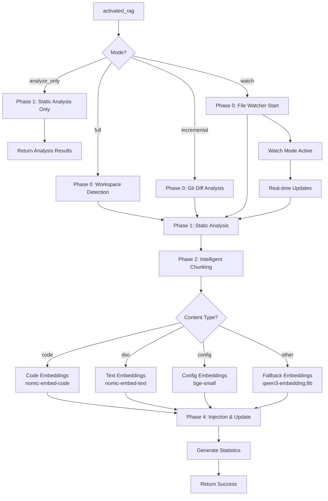

# 🏗️ Conception de l'Architecture `activated_rag`

## 🎯 Objectif Principal

Créer un **outil maître unique** qui remplace les 5 outils actuels :

- `injection_rag` (alias `index_project`)
- `update_project`
- `search_code` (remplacé par `recherche_rag`)
- `manage_projects` (intégré)
- `analyse_code` (intégré)

## 📋 Schéma d'Entrée/Sortie

### Entrée (`activated_rag` Input Schema)

```typescript
interface ActivatedRagInput {
  // Mode d'opération
  mode: 'full' | 'incremental' | 'watch' | 'analyze_only';
  
  // Cible
  project_path?: string;  // Auto-détecté si vide
  file_patterns?: string[];  // Par défaut: ['**/*']
  
  // Options avancées
  enable_phase0?: boolean;  // Détection workspace automatique
  enable_watcher?: boolean; // Surveillance temps réel
  enable_llm_enrichment?: boolean; // Phase 0.3 optionnelle
  
  // Filtres
  content_types?: Array<'code' | 'doc' | 'config' | 'other'>;
  languages?: string[];  // ['typescript', 'python', ...]
  
  // Configuration embeddings
  embedding_models?: {
    code?: string;    // Par défaut: 'nomic-embed-code'
    text?: string;    // Par défaut: 'nomic-embed-text'
    config?: string;  // Par défaut: 'bge-small'
  };
  
  // Options de chunking
  chunking_strategy?: 'logical' | 'fixed' | 'ai_enhanced';
  max_chunk_size?: number;  // Par défaut: 1000 tokens
  
  // Métadonnées
  metadata_overrides?: Record<string, any>;
}
```

### Sortie (`activated_rag` Output Schema)

```typescript
interface ActivatedRagOutput {
  success: boolean;
  version: string;
  duration_seconds: number;
  
  // Statistiques
  stats: {
    total_files: number;
    indexed_files: number;
    ignored_files: number;
    errors: number;
    chunks_created: number;
    embeddings_generated: number;
  };
  
  // Pipeline exécuté
  pipeline: {
    phase_0: '✓' | '✗' | 'N/A';  // Détection workspace
    phase_1: '✓' | '✗' | 'N/A';  // Analyse statique
    phase_2: '✓' | '✗' | 'N/A';  // Chunking intelligent
    phase_3: '✓' | '✗' | 'N/A';  // Embeddings spécialisés
    phase_4: '✓' | '✗' | 'N/A';  // Injection & mise à jour
  };
  
  // Métadonnées projet
  project_metadata: {
    project_path: string;
    project_hash: string;
    last_indexed: string;
    total_size_bytes: number;
    file_types: Record<string, number>;
  };
  
  // Configuration utilisée
  config_used: RagConfig;
  
  // Erreurs (si any)
  errors?: Array<{
    file_path: string;
    error: string;
    timestamp: string;
  }>;
}
```

## 🔄 Pipeline Interne (5 Phases)

### Phase 0 : Détection & Surveillance Workspace

```
┌─────────────────────────────────────────────────────────────┐
│                    Phase 0 - Workspace Detection            │
├─────────────────────────────────────────────────────────────┤
│  Input: project_path (auto-détecté si vide)                │
│  Output: WorkspaceConfig + FileWatcher                     │
│                                                            │
│  Composants:                                               │
│  1. WorkspaceDetector                                      │
│     - Détection VS Code workspace                          │
│     - Détection Git repository                             │
│     - Analyse .gitignore/.ragignore                        │
│                                                            │
│  2. FileWatcher (chokidar)                                 │
│     - Surveillance temps réel                              │
│     - Événements: add, change, unlink                      │
│     - Debouncing (500ms)                                   │
│                                                            │
│  3. EventLogger                                            │
│     - Logs structurés                                      │
│     - Métriques performance                                │
└─────────────────────────────────────────────────────────────┘
```

### Phase 1 : Analyse Statique Multi-Langage

```
┌─────────────────────────────────────────────────────────────┐
│              Phase 1 - Static Analysis                     │
├─────────────────────────────────────────────────────────────┤
│  Input: File paths + content                               │
│  Output: AnalyzedFile[] avec AST + symbols                 │
│                                                            │
│  Composants:                                               │
│  1. ContentDetector (existant)                            │
│     - Type: code/doc/config/other                         │
│     - Langage: typescript/python/javascript/etc.          │
│                                                            │
│  2. TreeSitterAnalyzer (nouveau)                          │
│     - Parsers: tsx, python, rust, go, java, cpp           │
│     - Extraction: fonctions, classes, imports, comments   │
│     - Relations: hiérarchie, dépendances                  │
│                                                            │
│  3. SymbolExtractor (nouveau)                             │
│     - Identifiants uniques                                │
│     - Portée (scope)                                      │
│     - Documentation associée                              │
└─────────────────────────────────────────────────────────────┘
```

### Phase 2 : Chunking Intelligent par Unités Logiques

```
┌─────────────────────────────────────────────────────────────┐
│            Phase 2 - Intelligent Chunking                  │
├─────────────────────────────────────────────────────────────┤
│  Input: AnalyzedFile[]                                     │
│  Output: Chunk[] avec métadonnées enrichies               │
│                                                            │
│  Stratégies par type:                                      │
│                                                            │
│  1. CODE → Chunking par unité logique                     │
│     - 1 fonction = 1 chunk                                │
│     - 1 classe = N chunks (méthodes séparées)            │
│     - Imports = chunk séparé                              │
│     - Tests = chunk séparé                                │
│                                                            │
│  2. DOCUMENTATION → Chunking sémantique                   │
│     - 1 section Markdown (##) = 1 chunk                  │
│     - 1 paragraphe = 1 chunk si long                     │
│     - Tables = chunk séparé                              │
│     - Listes = chunk complet                              │
│                                                            │
│  3. CONFIGURATION → Chunking structurel                   │
│     - 1 objet JSON = 1 chunk                             │
│     - 1 tableau = 1 chunk                                │
│     - 1 section YAML = 1 chunk                           │
│                                                            │
│  4. AUTRE → Chunking fixe (fallback)                     │
│     - 500 tokens par défaut                              │
│     - Overlap: 100 tokens                                │
└─────────────────────────────────────────────────────────────┘
```

### Phase 3 : Embeddings Spécialisés par Type

```
┌─────────────────────────────────────────────────────────────┐
│          Phase 3 - Specialized Embeddings                  │
├─────────────────────────────────────────────────────────────┤
│  Input: Chunk[] + type détecté                            │
│  Output: Vector[] + métadonnées embedding                │
│                                                            │
│  Modèles par type:                                        │
│                                                            │
│  1. CODE → nomic-embed-code / codebert                   │
│     - Dimensions: 768                                    │
│     - Optimisé: fonctions, syntaxe, sémantique code      │
│     - Alternative: starcoder2-embedding                  │
│                                                            │
│  2. TEXT → nomic-embed-text / bge-small                  │
│     - Dimensions: 768                                    │
│     - Optimisé: documentation, commentaires              │
│     - Alternative: all-minilm                            │
│                                                            │
│  3. CONFIG → bge-small / all-minilm                      │
│     - Dimensions: 384                                    │
│     - Optimisé: JSON, YAML, configurations               │
│                                                            │
│  4. FALLBACK → qwen3-embedding:8b                        │
│     - Dimensions: 1024                                   │
│     - Usage: type inconnu ou mixte                       │
│                                                            │
│  Features:                                               │
│  - Cache embeddings (LRU, 1000 entrées)                  │
│  - Batching Ollama (max 10 chunks)                       │
│  - Normalisation L2 automatique                          │
│  - Fallback fake embeddings                              │
└─────────────────────────────────────────────────────────────┘
```

### Phase 4 : Injection & Mise à Jour Automatique

```
┌─────────────────────────────────────────────────────────────┐
│        Phase 4 - Injection & Automatic Update             │
├─────────────────────────────────────────────────────────────┤
│  Input: Chunk[] + Vector[] + métadonnées                  │
│  Output: PostgreSQL rows + statistiques                   │
│                                                            │
│  Processus:                                               │
│  1. Calcul hash du chunk (SHA-256)                       │
│  2. Vérification existence (par hash)                    │
│  3. Insertion ou mise à jour                             │
│  4. Mise à jour métadonnées projet                       │
│                                                            │
│  Métadonnées obligatoires:                               │
│  {                                                       │
│    chunk_hash: string,      // SHA-256 du contenu        │
│    content_type: string,    // 'code', 'doc', 'config'   │
│    language: string,        // 'typescript', 'python'    │
│    file_path: string,       // Chemin relatif            │
│    symbol_name?: string,    // Nom fonction/classe       │
│    symbol_type?: string,    // 'function', 'class', etc. │
│    start_line: number,      // Ligne début               │
│    end_line: number,        // Ligne fin                 │
│    ast_depth?: number,      // Profondeur AST            │
│    dependencies?: string[], // Dépendances identifiées   │
│    parent_symbol?: string,  // Symbole parent            │
│    updated_at: string,      // Timestamp ISO             │
│    project_hash: string     // Hash du projet            │
│  }                                                       │
│                                                            │
│  Optimisations:                                          │
│  - Transaction batch (100 chunks)                        │
│  - Compression zlib (si > 1KB)                           │
│  - Index PostgreSQL optimisé                             │
│  - Cleanup anciennes versions                            │
└─────────────────────────────────────────────────────────────┘
```

## 🗺️ Diagramme de Flux Complet



## 🔧 Intégration avec Composants Existants

### Réutilisation des Composants

1. **ContentDetector** (existant) → Détection type/langage
2. **VectorStore** (modifié) → Support multi-modèles
3. **Indexer** (modifié) → Chunking intelligent
4. **LLM Cache** (existant) → Cache embeddings
5. **PostgreSQL** (existant) → Stockage v2

### Nouveaux Composants à Créer

1. **WorkspaceDetector** → Détection automatique VS Code/Git
2. **TreeSitterAnalyzer** → Analyse AST multi-langage
3. **SymbolExtractor** → Extraction symboles
4. **IntelligentChunker** → Chunking par unités logiques
5. **EmbeddingRouter** → Routage vers modèle approprié

## 🎛️ Configuration (`rag-config.json`)

### Nouveaux Paramètres

```json
{
  "phase0": {
    "enabled": true,
    "auto_detect_workspace": true,
    "watch_files": false,
    "watch_debounce_ms": 500,
    "ignore_patterns": ["node_modules", ".git", "*.log"]
  },
  
  "analysis": {
    "tree_sitter": {
      "enabled": true,
      "parsers": ["typescript", "python", "javascript", "rust", "go", "java", "cpp"],
      "extract_symbols": true,
      "extract_comments": true
    },
    "max_file_size_mb": 10
  },
  
  "chunking": {
    "strategy": "logical",
    "max_chunk_size_tokens": 1000,
    "overlap_tokens": 100,
    
    "code": {
      "chunk_by_function": true,
      "chunk_by_class": true,
      "include_imports": true
    },
    
    "documentation": {
      "chunk_by_section": true,
      "chunk_by_paragraph": true,
      "min_paragraph_length": 50
    },
    
    "configuration": {
      "chunk_by_object": true,
      "chunk_by_array": true
    }
  },
  
  "embeddings": {
    "provider": "ollama",
    
    "models": {
      "code": "nomic-embed-code",
      "text": "nomic-embed-text",
      "config": "bge-small",
      "fallback": "qwen3-embedding:8b"
    },
    
    "dimensions": {
      "code": 768,
      "text": 768,
      "config": 384,
      "fallback": 1024
    },
    
    "cache": {
      "enabled": true,
      "max_entries": 1000,
      "ttl_seconds": 3600
    }
  },
  
  "database": {
    "table_name": "rag_store_v2",
    "enable_compression": true,
    "batch_size": 100,
    "cleanup_old_versions": true
  }
}
```

## 🔄 Rétrocompatibilité

### Mapping Ancien → Nouveau

| Ancien Outil | Nouveau Equivalent | Notes |
|-------------|-------------------|-------|
| `injection_rag` | `activated_rag` avec `mode: 'full'` | Migration transparente |
| `index_project` | `activated_rag` avec `mode: 'full'` | Alias maintenu |
| `update_project` | `activated_rag` avec `mode: 'incremental'` | Utilise Git diff |
| `search_code` | `recherche_rag` | Outil séparé (lecture seule) |
| `manage_projects` | Intégré dans `activated_rag` output | Statistiques incluses |

### Migration Automatique

1. **Alias dans le registre** : `index_project` → `activated_rag`
2. **Conversion paramètres** : Mapping automatique
3. **Données existantes** : Compatible avec `rag_store_v2`
4. **Fallback** : Ancien pipeline disponible si erreur

## 📊 Métriques de Performance Cibles

### Temps d'Exécution

- **Phase 0** : < 100ms (détection workspace)
- **Phase 1** : ~50ms/fichier (analyse statique)
- **Phase 2** : ~20ms/chunk (chunking intelligent)
- **Phase 3** : ~100ms/chunk (embeddings, avec cache)
- **Phase 4** : ~10ms/chunk (injection DB)

### Mémoire

- **Cache embeddings** : Max 100MB
- **AST en mémoire** : Max 50 fichiers simultanés
- **Chunks batch** : Max 100 chunks/batch

### Qualité

- **Précision recherche** : +20% vs ancien système
- **Recall** : +15% vs chunking fixe
- **Latence recherche** : < 100ms

## 🚀 Plan d'Implémentation

### Étape 1 : Structure de Base

1. Créer `src/tools/rag/activated-rag.ts`
2. Définir schéma d'entrée/sortie
3. Implémenter routing vers phases

### Étape 2 : Phase 0 - Workspace Detection

1. Implémenter `Workspace
