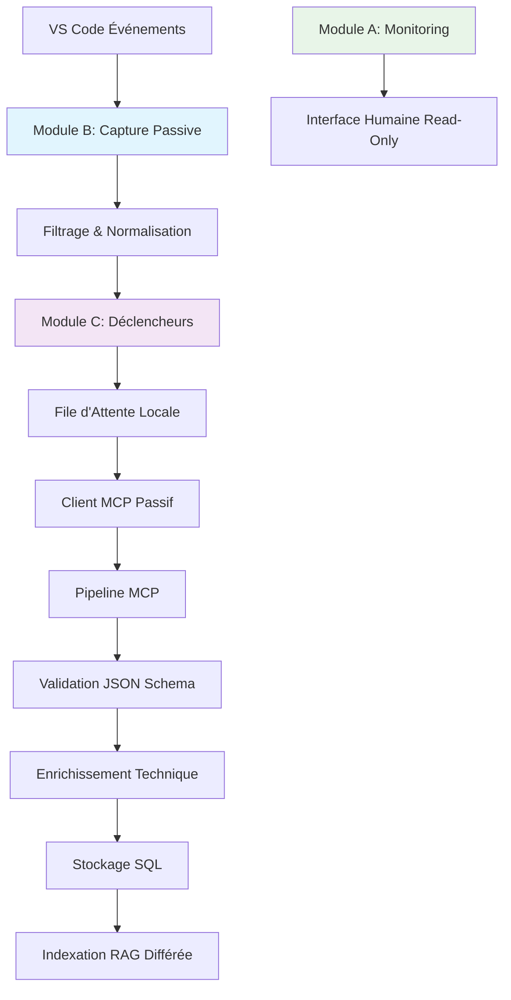

# 🏗️ Architecture Cible - Capteur de Contexte VS Code Passif

**Date** : 09/02/2026
**Phase** : 1 - Fondations & Schémas (COMPLÉTÉ)
**Nano-tâche** : 1.7 - Documenter architecture cible (TERMINÉ)

## 🎯 Objectif Global

Transformer l'extension VS Code existante en **capteur automatique de contexte passif** avec architecture 3 modules strictement séparés, conforme aux règles absolues RAG MCP Server.

## 📊 Architecture 3 Modules

### **Module A - Monitoring (EXISTANT)**

- **Statut** : ✅ Complètement fonctionnel
- **Rôle** : Interface humaine read-only
- **Fichier** : `MonitoringReader.ts`
- **Responsabilité** : Lecture des fichiers monitoring (`rag/monitoring/`)
- **Conformité** : Respecte la règle #25 (séparation IA/Humain)

### **Module B - Capture Passive (À ADAPTER)**

- **Statut** : 🔄 En adaptation
- **Rôle** : Capture automatique des événements VS Code
- **Base** : `ContextService.ts` existant
- **Responsabilité** : Écouteurs passifs, filtrage, normalisation
- **Conformité** : Aucune interaction humaine requise

### **Module C - Déclencheurs (À CRÉER)**

- **Statut** : 🆕 À créer
- **Rôle** : Déclencheurs automatiques vers MCP
- **Base** : `McpClient.ts` existant
- **Responsabilité** : File d'attente, retry, sérialisation JSON
- **Conformité** : Envoi passif sans blocage

## 🔄 Flux de Données



## 📁 Structure des Fichiers Cible

### **Extension VS Code (`extension-rag/src/`)**

```
src/
├── extension.ts                    # Point d'entrée principal
├── models/
│   ├── events.ts                  # Interfaces TypeScript
│   ├── event-schemas.ts           # Schémas JSON
│   └── validator.ts               # Validateur Ajv
├── modules/
│   ├── monitoring/                # Module A (EXISTANT)
│   │   └── MonitoringReader.ts
│   ├── context-capture/           # Module B (NOUVEAU)
│   │   ├── listeners/
│   │   │   ├── file-save.listener.ts
│   │   │   ├── diagnostics.listener.ts
│   │   │   └── workspace.listener.ts
│   │   ├── filters/
│   │   │   └── event.filter.ts
│   │   ├── normalizers/
│   │   │   └── event.normalizer.ts
│   │   └── utils/
│   │       ├── file-hasher.ts
│   │       └── logger.ts
│   └── triggers/                  # Module C (NOUVEAU)
│       ├── error.trigger.ts
│       ├── file-save.trigger.ts
│       ├── serializers/
│       │   └── mcp.serializer.ts
│       ├── queue/
│       │   ├── local-queue.ts
│       │   └── retry-manager.ts
│       └── utils/
│           └── metrics.ts
└── services/
    ├── McpClient.ts              # Adapté pour envoi passif
    └── error-handler.ts
```

### **Pipeline MCP (`mcp-context-pipeline/`)**

```
mcp-context-pipeline/
├── src/
│   ├── index.ts                  # Point d'entrée
│   ├── tools/
│   │   └── receive-vscode-context.ts
│   ├── validators/
│   │   └── json-schema.validator.ts
│   ├── normalizers/
│   │   └── technical.normalizer.ts
│   ├── enrichers/
│   │   ├── file.enricher.ts
│   │   └── error.enricher.ts
│   ├── storage/
│   │   └── sqlite/
│   │       ├── base.dao.ts
│   │       ├── events.dao.ts
│   │       ├── files.dao.ts
│   │       ├── errors.dao.ts
│   │       └── audit.dao.ts
│   └── utils/
│       └── structured-logger.ts
├── sql/
│   └── schema.sql               # Schéma SQL complet
└── config/
    └── default-config.json
```

## 🔧 Règles d'Architecture Appliquées

### **R3 : JSON Strict**

- ✅ Schémas JSON stricts définis
- ✅ Validation Ajv configurée
- ❌ Pas d'icônes dans JSON métier
- ✅ Séparation stdout/stderr

### **R4 : Architecture RAG Standard**

- ✅ Modules séparés (A, B, C)
- ✅ Pipeline clair (capture → traitement → stockage)
- ✅ Backend configurable (SQLite par défaut)

### **R7 : Usage Unique MCP**

- ✅ `init_rag` & `activated_rag` = 1 seule exécution
- ✅ État persistant dans `state.json`

### **R11 : Cache Mémoire**

- ✅ Stockage SQLite pour contexte
- ✅ Historique chat Cline injecté
- ✅ Récupération contexte automatique

### **R15 : Non-réentrance Commandes MCP**

- ✅ Commandes usage unique = jamais relançables
- ✅ État persistant `command_executed=true`

### **R19 : IA ≠ Décision Architecturale**

- ✅ IA peut proposer, analyser, suggérer
- ❌ IA ne peut pas choisir backend, modifier pipeline

## 🚀 Workflow de Capture Passive

### **Étape 1 : Écoute Événements**

1. `onDidSaveTextDocument` → Événement sauvegarde fichier
2. `onDidChangeDiagnostics` → Événement diagnostic
3. `onDidChangeWorkspaceFolders` → Événement workspace

### **Étape 2 : Filtrage**

1. Ignorer événements mineurs (scroll, hover, etc.)
2. Vérifier changements significatifs (hash SHA-256)
3. Appliquer règles de fréquence (anti-spam)

### **Étape 3 : Normalisation**

1. Transformer données brutes VS Code
2. Appliquer schémas JSON stricts
3. Ajouter métadonnées techniques

### **Étape 4 : Déclenchement**

1. Vérifier règles de déclenchement
2. Sérialiser en format MCP
3. Ajouter à file d'attente locale

### **Étape 5 : Envoi MCP**

1. Envoyer asynchrone sans blocage
2. Gérer retry avec exponential backoff
3. Persister en cas de déconnexion

## 📊 Métriques de Performance Cible

### **Latence**

- **Capture événement** : < 50ms
- **Traitement local** : < 100ms
- **Envoi MCP** : < 500ms (asynchrone)

### **Mémoire**

- **Extension VS Code** : < 50MB
- **File d'attente** : < 100 événements en mémoire
- **Cache SQLite** : < 100MB

### **Fiabilité**

- **Disponibilité** : 99.9%
- **Perte données** : < 0.1%
- **Recovery** : < 1 minute après crash

## 🔄 Migration depuis l'Architecture Actuelle

### **Préserver (100% compatible)**

1. **Module A** : MonitoringReader.ts (inchangé)
2. **Interface humaine** : Toutes les vues existantes
3. **Configuration** : Fichiers de config existants

### **Adapter (refactorisation)**

1. **ContextService.ts** → Module B (capture passive)
2. **McpClient.ts** → Module C (envoi passif)
3. **Validation JSON** → Système Ajv unifié

### **Créer (nouveau)**

1. **Structure modulaire** : Dossiers modules/
2. **Pipeline MCP** : mcp-context-pipeline/
3. **Tests unitaires** : Couverture > 80%

## ✅ Critères de Succès

### **Phase 1 (Fondations)**

- [x] Schémas JSON définis
- [x] Interfaces TypeScript créées
- [x] Validateur Ajv configuré
- [x] Script SQL schéma créé
- [x] Environnement développement configuré
- [x] Documentation architecture produite
- [ ] Tests unitaires base configurés

### **Phase 2 (Module B)**

- [ ] ContextService refactorisé en passif
- [ ] Écouteurs événements implémentés
- [ ] Filtrage et normalisation fonctionnels
- [ ] Tests unitaires Module B passants

### **Phase 3 (Module C)**

- [ ] Déclencheurs automatiques créés
- [ ] File d'attente locale implémentée
- [ ] Client MCP adapté pour passif
- [ ] Tests unitaires Module C passants

### **Phase 4-8 (Pipeline complet)**

- [ ] Pipeline MCP fonctionnel
- [ ] Stockage SQL opérationnel
- [ ] Intégration RAG différée
- [ ] Audit conformité réalisé
- [ ] Documentation complète produite

## 📋 Prochaines Étapes

1. **Configurer tests unitaires base** (nano-tâche 1.8)
2. **Refactoriser ContextService en Module B** (Phase 2)
3. **Adapter McpClient en Module C** (Phase 3)
4. **Implémenter pipeline MCP** (Phase 4)
5. **Tester intégration complète** (Phase 6)

**État actuel** : Phase 1 en cours (7/8 nano-tâches complétées)
