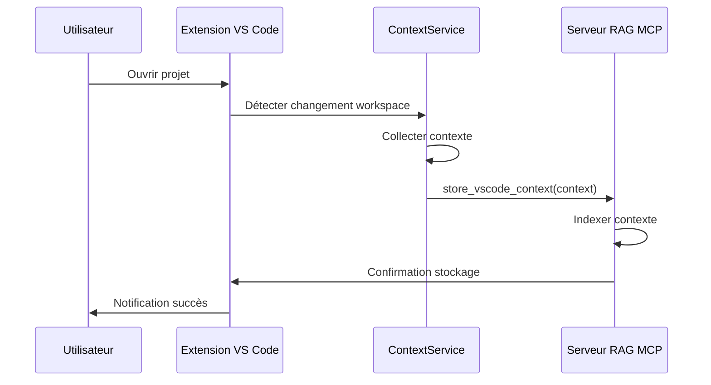
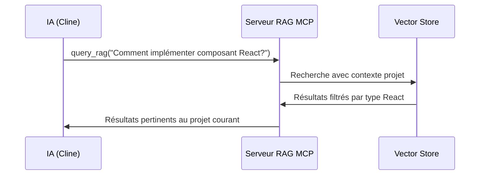

# API Contexte VS Code

## 📋 Vue d'ensemble

L'API Contexte VS Code permet de récupérer automatiquement le contexte du workspace VS Code pour enrichir les requêtes RAG avec des informations spécifiques au projet en cours.

## 🎯 Objectif

Fournir un contexte riche et structuré incluant :

- Configuration VS Code (settings, extensions recommandées)
- Informations Git (repository, branch, commit, changements)
- Structure du projet (fichiers de configuration, organisation)
- État de l'éditeur (fichiers ouverts, sélection, diagnostics)
- Extensions installées

## 🏗️ Architecture

### Composants

1. **ContextService** (`extension-rag/src/services/ContextService.ts`)
   - Service principal de collecte de contexte
   - Expose deux méthodes : `getFullContext()` et `getMinimalContext()`
   - Types TypeScript pour validation

2. **MCP Tool** (`src/tools/rag/vscode-context.ts`)
   - Outil MCP `store_vscode_context` pour stocker le contexte dans le RAG
   - Intégration avec le serveur RAG MCP

3. **Extension VS Code**
   - Interface utilisateur pour déclencher la collecte
   - Visualisation du contexte collecté

### Flux de données

```
┌─────────────────┐    ┌─────────────────┐    ┌─────────────────┐
│   Extension     │    │   Context       │    │   Serveur RAG   │
│   VS Code       │    │   Service       │    │   MCP           │
├─────────────────┤    ├─────────────────┤    ├─────────────────┤
│ • Bouton        │    │ • Collecte      │    │ • Stockage      │
│   "Collect      │───►│   contexte      │───►│   contexte      │
│   contexte"     │    │   complet       │    │   dans RAG      │
│ • Visualisation │    │ • Formatage     │    │ • Indexation    │
│   contexte      │    │   JSON          │    │   sémantique    │
└─────────────────┘    └─────────────────┘    └─────────────────┘
```

## 📊 Format des données

### Contexte complet (`getFullContext()`)

```typescript
interface VSCodeContext {
  timestamp: string; // ISO timestamp
  workspace: WorkspaceInfo; // Informations workspace
  configuration: VSCodeConfiguration; // Configuration VS Code
  git: GitInfo; // Informations Git
  project: ProjectStructure; // Structure projet
  editor: EditorState; // État éditeur
  extensions: ExtensionsInfo; // Extensions installées
  metadata: ContextMetadata; // Métadonnées service
}
```

### Contexte minimal (`getMinimalContext()`)

```typescript
interface MinimalContext {
  workspace_name: string; // Nom du workspace
  project_type: string; // Type de projet (react, nodejs, etc.)
  git_branch: string | null; // Branche Git actuelle
  open_files: number; // Nombre de fichiers ouverts
  has_errors: boolean; // Y a-t-il des erreurs de diagnostic
  timestamp: string; // ISO timestamp
}
```

## 🔧 Détails des interfaces

### WorkspaceInfo

```typescript
interface WorkspaceInfo {
  root: string | undefined; // Racine du workspace
  folders: WorkspaceFolder[]; // Dossiers du workspace
  is_multi_root: boolean; // Workspace multi-racine
  total_folders: number; // Nombre total de dossiers
  workspace_file: string | null; // Fichier .code-workspace
}

interface WorkspaceFolder {
  name: string; // Nom du dossier
  path: string; // Chemin absolu
  uri: string; // URI VS Code
}
```

### VSCodeConfiguration

```typescript
interface VSCodeConfiguration {
  settings: {
    workspace: any; // Settings .vscode/settings.json
    user: any; // Settings utilisateur
    default: any; // Settings par défaut
  };
  recommended_extensions: string[]; // Extensions recommandées
  workspace_configuration: {
    has_settings: boolean; // .vscode/settings.json existe
    has_extensions_json: boolean; // .vscode/extensions.json existe
    settings_path: string | null; // Chemin settings.json
    extensions_json_path: string | null; // Chemin extensions.json
  };
}
```

### GitInfo

```typescript
interface GitInfo {
  available: boolean; // Git est-il disponible
  reason?: string; // Raison si non disponible

  // Si available = true
  repository?: {
    root: string; // Racine repository
    head: string | null; // Branche actuelle
    commit: string | null; // Commit actuel
    upstream: string | null; // Branche upstream
    ahead: number; // Commits ahead
    behind: number; // Commits behind
  };

  status?: {
    working_changes: number; // Changements working tree
    index_changes: number; // Changements indexés
    merge_changes: number; // Changements merge
    total_changes: number; // Total changements
  };

  branches?: {
    current: string | null; // Branche actuelle
    local: string[]; // Branches locales
    remote: string[]; // Branches distantes
  };

  remotes?: GitRemote[]; // Remotes configurés
}

interface GitRemote {
  name: string; // Nom remote (origin, upstream)
  fetch_url: string | null; // URL fetch
  push_url: string | null; // URL push
}
```

### ProjectStructure

```typescript
interface ProjectStructure {
  available: boolean; // Analyse projet possible
  reason?: string; // Raison si non disponible

  // Si available = true
  root?: string; // Racine projet
  config_files?: ConfigFile[]; // Fichiers de configuration
  structure?: {
    directories: string[]; // Dossiers top-level
    files: string[]; // Fichiers top-level
    total_items: number; // Total items
    file_types: Record<string, number>; // Comptage par extension
  };
  package_info?: any; // Contenu package.json
  typescript_config?: any; // Contenu tsconfig.json
}

interface ConfigFile {
  name: string; // Nom fichier
  path: string; // Chemin absolu
  exists: boolean; // Existe-t-il
  content_preview: string; // Aperçu contenu (500 caractères)
}
```

### EditorState

```typescript
interface EditorState {
  active_editor: ActiveEditor | null; // Éditeur actif
  open_editors: OpenEditor[]; // Éditeurs ouverts
  diagnostics: DiagnosticsSummary; // Résumé diagnostics
}

interface ActiveEditor {
  document: {
    uri: string; // URI document
    language: string; // Langage (typescript, python, etc.)
    line_count: number; // Nombre de lignes
    is_untitled: boolean; // Document sans titre
  };
  selection: {
    start: vscode.Position; // Début sélection
    end: vscode.Position; // Fin sélection
    is_empty: boolean; // Sélection vide
  };
  visible_ranges: VisibleRange[]; // Ranges visibles
}

interface OpenEditor {
  uri: string; // URI document
  language: string; // Langage
  line_count: number; // Nombre de lignes
}

interface VisibleRange {
  start: vscode.Position; // Début range
  end: vscode.Position; // Fin range
}

interface DiagnosticsSummary {
  total: number; // Total diagnostics
  by_severity: Record<string, number>; // Par sévérité
  files_with_diagnostics: number; // Fichiers avec diagnostics
}
```

### ExtensionsInfo

```typescript
interface ExtensionsInfo {
  total: number; // Total extensions
  enabled: number; // Extensions activées
  disabled: number; // Extensions désactivées
  workspace_recommended: number; // Extensions recommandées workspace
  by_category: Record<string, number>; // Par catégorie
}
```

### ContextMetadata

```typescript
interface ContextMetadata {
  context_service_version: string; // Version service
  collected_at: string; // Timestamp collecte
  workspace_root: string | null; // Racine workspace
}
```

## 🚀 Utilisation

### Depuis l'extension VS Code

```typescript
import { ContextService } from "./services/ContextService";

// Initialisation
const contextService = new ContextService();

// Récupération contexte complet
const fullContext = await contextService.getFullContext();
console.log("Contexte complet:", JSON.stringify(fullContext, null, 2));

// Récupération contexte minimal
const minimalContext = await contextService.getMinimalContext();
console.log("Contexte minimal:", minimalContext);
```

### Via MCP Tool

```typescript
// Appel MCP pour stocker le contexte
const result = await mcpClient.call('store_vscode_context', {
  context: fullContext
});

// Réponse
{
  "status": "success",
  "message": "Contexte VS Code stocké avec succès",
  "context_id": "ctx_123456789",
  "timestamp": "2026-01-30T22:10:14.123Z"
}
```

### Intégration avec RAG

Le contexte VS Code est utilisé pour enrichir les requêtes RAG :

1. **Filtrage par projet** : Limiter les résultats au projet courant
2. **Priorisation** : Donner plus de poids aux fichiers du workspace
3. **Contexte sémantique** : Comprendre le type de projet (React, Node.js, etc.)
4. **État courant** : Tenir compte des fichiers ouverts et modifications

## 📝 Exemples

### Exemple 1 : Contexte complet

```json
{
  "timestamp": "2026-01-30T22:10:14.123Z",
  "workspace": {
    "root": "/home/user/projects/my-app",
    "folders": [
      {
        "name": "my-app",
        "path": "/home/user/projects/my-app",
        "uri": "file:///home/user/projects/my-app"
      }
    ],
    "is_multi_root": false,
    "total_folders": 1,
    "workspace_file": null
  },
  "configuration": {
    "settings": {
      "workspace": {
        "editor.formatOnSave": true,
        "typescript.preferences.importModuleSpecifier": "relative"
      },
      "user": {
        "editor.fontSize": 14,
        "workbench.colorTheme": "Default Dark Modern"
      },
      "default": {}
    },
    "recommended_extensions": [
      "dbaeumer.vscode-eslint",
      "esbenp.prettier-vscode"
    ],
    "workspace_configuration": {
      "has_settings": true,
      "has_extensions_json": true,
      "settings_path": "/home/user/projects/my-app/.vscode/settings.json",
      "extensions_json_path": "/home/user/projects/my-app/.vscode/extensions.json"
    }
  },
  "git": {
    "available": true,
    "repository": {
      "root": "/home/user/projects/my-app",
      "head": "feature/new-ui",
      "commit": "a1b2c3d4e5f67890123456789012345678901234",
      "upstream": "origin/feature/new-ui",
      "ahead": 3,
      "behind": 0
    },
    "status": {
      "working_changes": 5,
      "index_changes": 2,
      "merge_changes": 0,
      "total_changes": 7
    },
    "branches": {
      "current": "feature/new-ui",
      "local": ["main", "feature/new-ui", "bugfix/login"],
      "remote": ["origin/main", "origin/feature/new-ui"]
    },
    "remotes": [
      {
        "name": "origin",
        "fetch_url": "git@github.com:user/my-app.git",
        "push_url": "git@github.com:user/my-app.git"
      }
    ]
  },
  "project": {
    "available": true,
    "root": "/home/user/projects/my-app",
    "config_files": [
      {
        "name": "package.json",
        "path": "/home/user/projects/my-app/package.json",
        "exists": true,
        "content_preview": "{\n  \"name\": \"my-app\",\n  \"version\": \"1.0.0\",\n  \"dependencies\": {\n    \"react\": \"^18.2.0\",\n    \"react-dom\": \"^18.2.0\"\n  }\n}"
      },
      {
        "name": "tsconfig.json",
        "path": "/home/user/projects/my-app/tsconfig.json",
        "exists": true,
        "content_preview": "{\n  \"compilerOptions\": {\n    \"target\": \"es2020\",\n    \"module\": \"commonjs\"\n  }\n}"
      }
    ],
    "structure": {
      "directories": ["src", "public", "node_modules"],
      "files": ["package.json", "tsconfig.json", "README.md"],
      "total_items": 6,
      "file_types": {
        ".json": 2,
        ".md": 1,
        "": 3
      }
    },
    "package_info": {
      "name": "my-app",
      "version": "1.0.0",
      "dependencies": {
        "react": "^18.2.0",
        "react-dom": "^18.2.0"
      }
    },
    "typescript_config": {
      "compilerOptions": {
        "target": "es2020",
        "module": "commonjs"
      }
    }
  },
  "editor": {
    "active_editor": {
      "document": {
        "uri": "file:///home/user/projects/my-app/src/App.tsx",
        "language": "typescriptreact",
        "line_count": 150,
        "is_untitled": false
      },
      "selection": {
        "start": { "line": 42, "character": 10 },
        "end": { "line": 42, "character": 25 },
        "is_empty": false
      },
      "visible_ranges": [
        {
          "start": { "line": 35, "character": 0 },
          "end": { "line": 50, "character": 0 }
        }
      ]
    },
    "open_editors": [
      {
        "uri": "file:///home/user/projects/my-app/src/App.tsx",
        "language": "typescriptreact",
        "line_count": 150
      },
      {
        "uri": "file:///home/user/projects/my-app/src/index.ts",
        "language": "typescript",
        "line_count": 20
      }
    ],
    "diagnostics": {
      "total": 3,
      "by_severity": {
        "error": 1,
        "warning": 2,
        "information": 0,
        "hint": 0
      },
      "files_with_diagnostics": 2
    }
  },
  "extensions": {
    "total": 45,
    "enabled": 40,
    "disabled": 5,
    "workspace_recommended": 2,
    "by_category": {
      "Programming Languages": 15,
      "Linters": 8,
      "Themes": 5,
      "Other": 17
    }
  },
  "metadata": {
    "context_service_version": "1.0.0",
    "collected_at": "2026-01-30T22:10:14.123Z",
    "workspace_root": "/home/user/projects/my-app"
  }
}
```

### Exemple 2 : Contexte minimal

```json
{
  "workspace_name": "my-app",
  "project_type": "react",
  "git_branch": "feature/new-ui",
  "open_files": 2,
  "has_errors": true,
  "timestamp": "2026-01-30T22:10:14.123Z"
}
```

## 🔄 Workflows d'intégration

### Workflow 1 : Collecte automatique



### Workflow 2 : Requête RAG enrichie


